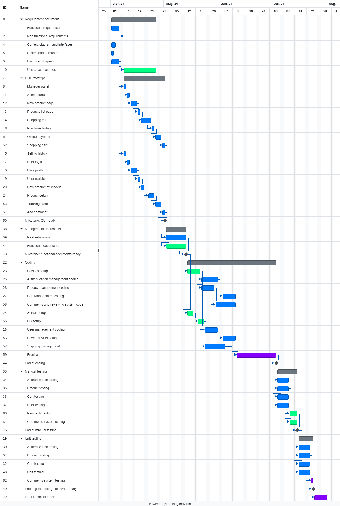

# Project Estimation - FUTURE

Date: 4/5/2024

Version: 2.0

# Estimation approach

Consider the EZElectronics project in FUTURE version (as proposed by your team in requirements V2), assume that you are going to develop the project INDEPENDENT of the deadlines of the course, and from scratch (not from V1)

# Estimate by size

###

|                                                                                                         | Estimate |
| ------------------------------------------------------------------------------------------------------- | -------- |
| NC = Estimated number of classes to be developed                                                        | 14       |
| A = Estimated average size per class, in LOC                                                            | 300      |
| S = Estimated size of project, in LOC (= NC \* A)                                                       | 4200     |
| E = Estimated effort, in person hours (here use productivity 10 LOC per person hour)                    | 420      |
| C = Estimated cost, in euro (here use 1 person hour cost = 30 euro)                                     | 12600    |
| Estimated calendar time, in calendar weeks (Assume team of 4 people, 8 hours per day, 5 days per week ) | 2.6      |

# Estimate by product decomposition

###

| component name       | Estimated effort (person hours) |
| -------------------- | ------------------------------- |
| requirement document |             55                    |
| GUI prototype        |              30                   |
| design document      |              20                   |
| code                 |               200                  |
| unit tests           |                30                 |
| api tests            |                 30                |
| management documents |                 40                |

# Estimate by activity decomposition

###
| Activity name | Estimated effort (person hours) |
| ------------- | ------------------------------- |
|   **Requirements Documents**             |       46                          |
|    Functional Requirements          |      5                           |
|  Non Functional Requirements          |     1                            |
|  Context diagram and interfaces          |     3                            |
|  Stories and personas          |     2                            |
|  Use case diagram          |         5                        |
|  Use case scenarios          |            30                     |
|   **GUI Prototype**            |       34                          |
|   Manager Panel          |      2                           |
|   Admin Panel          |      2                           |
| New Product          |     2                            |
|  Products List          |                 2                |
|     Shopping Cart          |         4                        |
|     Purchase history          |         2                        |
|     Selling History          |         2                        |
|      User Login          |            2                     |
|      User Profile          |            2                     |
|      User Register          |            2                     |
|      New Product By models          |            2                     |
|      Product Details          |            4                     |
|      Online payment          |            2                     |
|      Tracking Panel          |            2                     |
|      Add comment          |            2                     |
|   **Coding**            |       140                          |
|    Classes Setup          |      12                           |
|  Server Setup          |     8                            |
| Authentication Management          |                  8               |
|     Product Management          |         6                        |
|      Cart Management          |            6                    |
|      User Management          |            6                     |
|      Database setup          |            8                     |
|      Payment APIs setup          |            8                     |
|      Shipping management          |            8                     |
|      Comments and reviews system          |            8                     |
|      Front-end          |            70                     |
|   **Manual Testing**            |       30                          |
|  Authentication Testing          |                 5                |
|      Product Testing          |         5                        |
|      Cart Testing          |            5                    |
|       User Testing          |            5                     |
|       Payments Testing          |            5                     |
|       Comments system Testing          |            5                     |
|   **Unit Testing**            |       34                          |
|  Authentication Testing          |                 8                |
|      Product Testing          |         6                        |
|       Cart Testing          |            6                    |
|       User Testing          |            6                     |
|       Comments system testing          |            8                     |
|   **Management Documents**            |       24                          |
|     Real Estimation          |                 8                |
|     Functional documents          |                 16                |
|  **Final Technical Report**          |         30                        |
###

Note: we decided to consider the gantt chart as if we have 1 working hour per working day as an average and we are four people.
Each blue bar indicates that one person is working on that specific task in that moment. A green bar indicates that two people are working on that specific task in that moment. Orange bars indicates 3 people on that specific task. Purple indicates that everybody works on the same task. 

# Summary

Report here the results of the three estimation approaches. The estimates may differ. Discuss here the possible reasons for the difference

|                                    | Estimated effort | Estimated duration |
| ---------------------------------- | ---------------- | ------------------ |
| estimate by size                   |      420            |2.6
| estimate by product decomposition  |    405              |2.5
| estimate by activity decomposition |      338            | 2.1

Estimating by lines of code is too simple and may mislead (there are a lot of documents too). 
Estimating by product decomposition is fine but it is not as detailed ad estimating by activity.
We think estimation by activity is the most reliable. 
