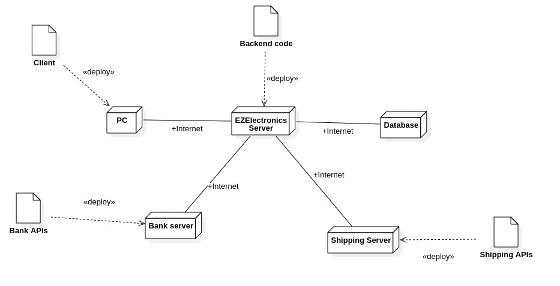

# Requirements Document - current EZElectronics

Date: 3/05/2024

Version: V2 - description of EZElectronics in CURRENT form (as received by teachers)

| Version number |                                                   Change                                                   |
| :------------: | :--------------------------------------------------------------------------------------------------------: |
|      1.0       | Added stakeholders, Functional Requirements, Non Functional Requirements, Interfaces, Stories and Personas |
|      1.1       |                                    Added Glossary and Use Case diagram                                     |
|      1.2       |                           Added System Design, Use Cases and Deployment Diagram                            |

# Contents

- [Requirements Document - current EZElectronics](#requirements-document---current-ezelectronics)
- [Contents](#contents)
- [Informal description](#informal-description)
- [Stakeholders](#stakeholders)
- [Context Diagram and interfaces](#context-diagram-and-interfaces)
  - [Context Diagram](#context-diagram)
  - [Interfaces](#interfaces)
- [Stories and personas](#stories-and-personas)
- [Functional and non functional requirements](#functional-and-non-functional-requirements)
  - [Functional Requirements](#functional-requirements)
  - [Non Functional Requirements](#non-functional-requirements)
- [Use case diagram and use cases](#use-case-diagram-and-use-cases)
  - [Use case diagram](#use-case-diagram)

    - [Use Case1 Registration](#use-case1-uc1-registration)
    - [Use Case 2 Login](#use-case-2-uc2-login)
    - [Use Case 3 Logout](#use-case-3-uc3-logout)

    - [Use Case 4 Session](#use-case-4-uc4-session)
    - [Use case 5 List All Users](#use-case-5-uc5-list-all-users)
    - [Use case 6 Delete User](#use-case-6-uc6-delete-user)
    - [Use case 7 Search Users](#use-case-7-uc7-search-users)
    - [Use Case 8 New Product](#use-case-8-uc8-new-product)
    - [Use Case 9 Insert new stocks](#use-case-9-uc9-insert-new-stocks)
    - [Use Case 10 Mark as sold](#use-case-10-uc10-mark-as-sold)
    - [Use Case 11 Delete Product](#use-case-11-uc11-delete-product)
    - [Use case 12 Search Product](#use-case-12-uc12-search-product)
    - [Use Case 13 Add Product to the Cart](#use-case-13-uc13-add-product-to-the-cart)
    - [Use Case 14 Remove Product from the Cart](#use-case-14-uc14-remove-product-from-the-cart)
    - [Use Case 15 Pay Car](#use-case-15-uc15-pay-cart)
    - [Use Case 16 Delete Cart](#use-case-16-uc16-delete-cart)
    - [Use case 17 Carts History](#use-case-17-uc17-carts-history)
    - [Use case 18 Rating and Commenting Management](#use-case-18-uc18-rating-and-commenting-management)
    - [Use case 19 Shipment Management](#use-case-19-uc19-shipment-management)
    - [Use case 20 Differents Shipping Type ](#use-case-20-uc20-differents-shipping-type-regular-express)
    - [Use Case 21 Differents Payment Methods](#use-case-21-uc21-differents-payment-methods-paypal-satispay-visa)
    - [Use Case 22 Account Management](#use-case-22-uc22-account-management)
    - [Use Case 23 Compare Products](#use-case-23-uc23-compare-products)
    - [Use Case 24 Wish List](#use-case-24-uc24-wish-list)
    - [Use Case 25 Confirm Order](#use-case-25-uc25-confirm-order)
    - [Use Case 26 Available Notification Products](#use-case-26-uc26-available-notification-products)
- [Glossary](#glossary)
- [System Design](#system-design)
- [Deployment Diagram](#deployment-diagram)

# Informal description

EZElectronics (read EaSy Electronics) is a software application designed to help managers of electronics stores to manage their products and offer them to customers through a dedicated website. Managers can assess the available products, record new ones, and confirm purchases. Customers can see available products, add them to a cart and see the history of their past purchases.

# Stakeholders

|    Stakeholder name    |                                    Description                                     |
| :--------------------: | :--------------------------------------------------------------------------------: |
|          User          |          The customer buying or the manager selling electronic components          |
|       Developers       |                   Develop all technical aspects of the software                    |
|  System adminstrator   | User who has special privileges (It may manage all the featuers for all the users) |
| Online payment service |                    Banking agreements (API to perform payments)                    |
|    Support service     |             Guiding customers to buy products and working on Barcodes              |
|   Shipping companies   |                    Shipment agreements to manage the shipments                     |

# Context Diagram and interfaces

## Context Diagram

## Interfaces

|        Actor        |   Logical Interface   | Physical Interface  |
| :-----------------: | :-------------------: | :-----------------: |
|        User         | GUI - Web application |  Smart phone / PC   |
| System adminstrator | GUI - Web application |  Smart phone / PC   |
|  Payments service   |      GUI - APIs       | Internet conection  |
|   Support service   |     Specific GUI      |         PC          |
|  Shipping service   |      GUI - APIs       | Internet connection |

# Stories and personas

### Persona 1 (P1): CUSTOMER, female, 22 y.o., student.  system

Interacts with the application through a web browser on her phone.  
Story: wants to buy some electronics stuff for her Arduino project.

### Persona 2 (P2): MANAGER, male, 30 y.o., worker.  

Interacts with the application through a web browser on his laptop.  
Story: has opened a new electronics company and wants to sell their stocks throught the platform

### Persona 3 (P3): MANAGER, female, 47 y.o, worker.  

Interacts with the application through a web browser on his desktop computer.  
Story: wants to perform a market analysis to buy the best component for the quality-price ratio.

### Persona 4 (P4): CUSTOMER, male, 27 y.o., not worker.  

Interacts with the application through a web browser on his desktop computer.  
Story: wants to buy the cheapest components hoping to resell them at higher prices on other platforms.

### Persona 5 (P5): SYSTEM ADMINISTRATOR, male, 55 y.o.  

Interacts with the application through a web browser on his desktop computer.  
Story: a manager is a fraudster and is deleting his account.

### Persona 6 (P6): SYSTEM ADMINISTRATOR, female, 45 y.o.  

Interacts with the application through a web browser on his desktop computer.  
Story: is deleting the inappropriated comments posted by a customer.

# Functional and non functional requirements

## Functional Requirements

| ID      |                               Description                                |
| ------- | :----------------------------------------------------------------------: |
| **FR1** |                       **Authentication Managment**                       |
| FR1.1   |                               Registration                               |
| FR1.2   |                                  Login                                   |
| FR1.3   |                                  Logout                                  |
| FR1.4   |                                 Session                                  |
|         |                                                                          |
| **FR2** |                           **Cart Management**                            |
| FR2.1   |                               Add product                                |
| FR2.2   |                              Delete product                              |
| FR2.3   |                         Calculation of the price                         |
| FR2.4   |                              Marks as sold                               |
| FR2.5   |                    History of previous purchase carts                    |
| FR2.6   |            Edit purchase cart before "order confirmed" status            |
|         |                                                                          |
| **FR3** |                          **Product Management**                          |
| FR3.1   |                           Create a new product                           |
| FR3.2   |       Registers the arrival of a set of products of the same model       |
| FR3.3   |                         Marks a product as sold                          |
| FR3.4   | Search for products based on one of their properties or receive them all |
| FR3.5   |             Delete products based on one of their properties             |
| FR3.6   |                       Comparison between products                        |
| FR3.7   |                                Wish list                                 |
| FR3.8   |              Reminder product availability (by mail or ...)              |
|         |                                                                          |
| **FR4** |                          **Account Management**                          |
| FR4.1   |                       Edit own access credentials                        |
| FR4.2   |                   Search manager based on its username                   |
| FR4.3   |                            Delete own account                            |
|         |                                                                          |
| **FR5** |                          **Payment Management**                          |
| FR5.1   |          Differents payment methods (Paypal, Satispay, Visa...)          |
| FR5.2   |                              Discount codes                              |
| FR5.3   |                         Get transaction history                          |
| FR5.4   |                         Favourite payment method                         |
|         |                                                                          |
| **FR6** |                   **Rating and Commenting Management**                   |
| FR6.1   |                    Add comments to previous purchase                     |
| FR6.2   |                        Add rating between 1 and 5                        |
| FR6.3   |                     Edit previous published comment                      |
|         |                                                                          |
| **FR7** |                         **Shipment Management**                          |
| FR7.1   |              Differents shipping type (regular, express...)              |
| FR7.2   |                             Tracking number                              |
| FR 7.3  |                        Favourite shipment address                        |
|         |                                                                          |

## Non Functional Requirements

|  ID  | Type (efficiency, reliability, ..) |                                                   Description                                                   |             Refers to             |
| :--: | :--------------------------------: | :-------------------------------------------------------------------------------------------------------------: | :-------------------------------: |
| NFR1 |              Security              | Legislative requirements of the country in which the application will be used. Only authorized users can access | FR1, FR2, FR3, FR4, FR5, FR6, FR7 |
| NFR2 |            Availability            |                                     Maximum server downtime 0.01% per year                                      | FR1, FR2, FR3, FR4, FR5, FR6, FR7 |
| NFR3 |            Portability             |                                Independent from the OS, only Web Browser needed                                 | FR1, FR2, FR3, FR4, FR5, FR6, FR7 |
| NFR4 |             Usability              |                               No training required for use, have to be intuitive                                | FR1, FR2, FR3, FR4, FR5, FR6, FR7 |
| NFR5 |             Efficiency             |                           All functions should be completed in less than 1.5 seconds                            | FR1, FR2, FR3, FR4, FR5, FR6, FR7 |

# Use case diagram and use cases

## Use case diagram

### Use Case1, UC1: Registration

| User                            |                                      |
| ------------------------------- | :----------------------------------- |
| Precondition                    | User has a valid username            |
| Post condition                  | Account is created                   |
| Nominal Scenario                | Scenario 1.1 and 1.2                 |
| Variants                        | -                                    |
| Exceptions                      | - Username is already registered  |
| Post condition (exception case) | Account not created                  |

| Scenario 1.1   |                                                                                 |
| -------------- | :------------------------------------------------------------------------------ |
| Precondition   | User has a valid username                                                       |
| Post condition | Account is created                                                              |
| # Step         | Description                                                                     |
| 1              | User asks to sign up                                                            |
| 2              | System asks for username and checks if it has already been used by another user |
| 3              | System asks for password and checks if it is not empty                          |
| 4              | System created account                                                          |

| Scenario 1.2   |                                                                                 |
| -------------- | :------------------------------------------------------------------------------ |
| Precondition   | User has a valid username                                                       |
| Post condition | Account is not created                                                          |
| # Step         | Description                                                                     |
| 1              | User asks to sign up                                                            |
| 2              | System asks for username and checks if it has already been used by another user |
| 3              | Username already existed                                                        |
| 4              | System not create the account, error 409 shown                                  |

### Use Case 2, UC2: Login

| User                            |                           |
| ------------------------------- | :------------------------ |
| Precondition                    | User must have an account |
| Post condition                  | User is authenticated     |
| Nominal Scenario                | Scenario 2.1 and 2.2      |
| Variants                        | -                         |
| Exceptions                      | - Wrong credentials    |
| Post condition (exception case) | User not authenticated    |

| Scenario 2.1   |                                                    |
| -------------- | :------------------------------------------------- |
| Precondition   | User must have an account                          |
| Post condition | User is authorized                                 |
| # Step         | Description                                        |
| 1              | User asks to login                                 |
| 2              | System asks username and password                  |
| 3              | User enters username and password                  |
| 4              | System checks if username and password are correct |
| 5              | User is logged in                                  |

| Scenario 2.2   |                                                    |
| -------------- | :------------------------------------------------- |
| Precondition   | User must have an account                          |
| Post condition | User is authorized                                 |
| # Step         | Description                                        |
| 1              | User asks to login                                 |
| 2              | System asks username and password                  |
| 3              | User enters username and password                  |
| 4              | System checks if username and password are correct |
| 5              | Credentials are incorrect, User is not logged in   |

### Use Case 3, UC3: Logout

| User             |                                  |
| ---------------- | :------------------------------: |
| Precondition     | User is logged id and authorized |
| Post condition   |        User is logged out        |
| Nominal Scenario |           Scenario 3.1           |
| Variants         |                                  |
| Exceptions       |                                  |

| Scenario 3.1   |      (Nominal)      |
| -------------- | :-----------------: |
| Precondition   |  User is logged in  |
| Post condition | User is logged out  |
| Step#          |     Description     |
| 1              | User asks to logout |
| 2              | User is logged out  |

### Use Case 4, UC4 Session

| User             |                                  |
| ---------------- | :------------------------------: |
| Precondition     | User is logged id and authorized |
| Post condition   |  User information are retrieved  |
| Nominal Scenario |           Scenario 4.1           |
| Variants         |                                  |
| Exceptions       |                                  |

| Scenario 4.1   |                   (Nominal)                    |
| -------------- | :--------------------------------------------: |
| Precondition   |               User is logged in                |
| Post condition |         User information are retrieved         |
| Step#          |                  Description                   |
| 1              |        User ask to refresh the Web page        |
| 2              | System checks if the User is already logged in |
| 3              |         User information are retrieved         |

### Use case 5, UC5 List all Users

| User             |                           |
| ---------------- | :-----------------------: |
| Precondition     |           None            |
| Post condition   | list of Users is returned |
| Nominal Scenario |            5.1            |
| Variants         |                           |
| Exceptions       |                           |

| Scenario 5.1   |                                                   |
| -------------- | :-----------------------------------------------: |
| Precondition   |          Corresponding web page is open           |
| Post condition |              list of users is shown               |
| Step#          |                    Description                    |
| 1              | User clicks on the button which get all the users |
| 2              |             list of users is returned             |

### Use case 6, UC6 Delete User

| Actors Involved                 |                 User                 |
| ------------------------------- | :----------------------------------: |
| Precondition                    |          User is logged in           |
| Post condition                  |           User is deleted            |
| Nominal Scenario                |                 6.1                  |
| Variants                        |                                      |
| Exceptions                      |       -Username does not exist       |
| Post condition (exception case) | User not deletes, error is sent back |

| Scenario 6.1   |                                               |
| -------------- | :-------------------------------------------: |
| Precondition   |               User is logged in               |
| Post condition |                User is deleted                |
| Step#          |                  Description                  |
| 1              |         User clicks "Delete account"          |
| 2              |        A Request to the System is sent        |
| 3              | System cheks if the username exist (Back-end) |
| 4              |                  User Delete                  |

### Use case 7, UC7 Search Managers

| User                            |                                                    |
| ------------------------------- | :------------------------------------------------: |
| Precondition                    |                        None                        |
| Post condition                  |      User are found base on role or username       |
| Nominal Scenario                |                 7.1, 7.2, 7.3, 7.4                 |
| Variants                        |                                                    |
| Exceptions                      | -Username does not exist   -Role does not exist |
| Post condition (exception case) |        User not deletes, error is sent back        |

| Scenario 7.1   |                                                     |
| -------------- | :-------------------------------------------------: |
| Precondition   |                        None                         |
| Post condition |                  Manager is found                   |
| Step#          |                     Description                     |
| 1              | User clicks on the button which get all the Manager |
| 2              |              Users found are retrived               |

| Scenario 7.2   |                                                           |
| -------------- | :-------------------------------------------------------: |
| Precondition   |                           None                            |
| Post condition |           Manager is found base on its username           |
| Step#          |                        Description                        |
| 1              | User clicks on the button which get the Users by username |
| 2              |            System cheks if the username exist             |
| 3              |                  User found is retrived                   |

| Scenario 7.3   |                                                          |
| -------------- | :------------------------------------------------------: |
| Precondition   |                           None                           |
| Post condition |                    User is not found                     |
| Step#          |                       Description                        |
| 1              | User clicks on the button which get Managers by username |
| 2              |            System cheks if the username exist            |
| 3              |                    Username not found                    |
| 3              |                     Message is shown                     |

| Scenario 7.4   |                                                       |
| -------------- | :---------------------------------------------------: |
| Precondition   |                         None                          |
| Post condition |             unsuccessful search for users             |
| Step#          |                      Description                      |
| 1              | User clicks on the button which get the Users by role |
| 2              |           System cheks if the role is valid           |
| 3              |                   Role is not valid                   |
| 3              |                   Message is shown                    |

### Use Case 8, UC8: New Product

| User                            |                                                                                          |
| ------------------------------- | :--------------------------------------------------------------------------------------- |
| Precondition                    | User must be logged as a Manager                                                         |
| Post condition                  | New product is inserted                                                                  |
| Nominal Scenario                | Scenario 8.1, 8.2 and 8.3                                                                |
| Variants                        | -                                                                                        |
| Exceptions                      | - Product code already exist  - Arrival date of the product is after the current date |
| Post condition (exception case) | Product not inserted                                                                     |

| Scenario 8.1   |                                                                   |
| -------------- | :---------------------------------------------------------------- |
| Precondition   | Manager must be logged in                                         |
| Post condition | New Product in inserted in the System                             |
| # Step         | Description                                                       |
| 1              | User asks to insert a new product                                 |
| 2              | System asks for all the fields, such as "Code" and "Arrival Date" |
| 3              | User inserts all the fields                                       |
| 4              | System checks if all the inputs are valid, if so...               |
| 5              | A new product is inserted into the System                         |

| Scenario 8.2   |                                                                   |
| -------------- | :---------------------------------------------------------------- |
| Precondition   | Manager must be logged in                                         |
| Post condition | New Product is NOT inserted into the System                       |
| # Step         | Description                                                       |
| 1              | User asks to insert a new product                                 |
| 2              | System asks for all the fields, such as "Code" and "Arrival Date" |
| 3              | User inserts all the fields                                       |
| 4              | System checks if all the inputs are valid                         |
| 5              | Code already exists                                               |
| 6              | A error message is shown                                          |
| 7              | A new product is NOT inserted into the System                     |

| Scenario 8.3   |                                                                   |
| -------------- | :---------------------------------------------------------------- |
| Precondition   | Manager must be logged in                                         |
| Post condition | New Product is NOT inserted into the System                       |
| # Step         | Description                                                       |
| 1              | User asks to insert a new product                                 |
| 2              | System asks for all the fields, such as "Code" and "Arrival Date" |
| 3              | User inserts all the fields                                       |
| 4              | System checks if all the inputs are valid                         |
| 5              | Arrival date is not valid                                         |
| 6              | A error message is shown                                          |
| 7              | A new product is NOT inserted into the System                     |

### Use Case 9, UC9: Insert new stocks

| User                            |                                                         |
| ------------------------------- | :------------------------------------------------------ |
| Precondition                    | Manager must be logged in                               |
| Post condition                  | New stocks are inserted into the System                 |
| Nominal Scenario                | Scenario 9.1 and 9.2                                    |
| Variants                        | -                                                       |
| Exceptions                      | - Arrival date of the stocks are after the current date |
| Post condition (exception case) | Stock not inserted                                      |

| Scenario 9.1   |                                                     |
| -------------- | :-------------------------------------------------- |
| Precondition   | Manager must be logged in                           |
| Post condition | New stocks are inserted into the System             |
| # Step         | Description                                         |
| 1              | User asks to insert a new product                   |
| 2              | System asks for all the fields, such "Arrival Date" |
| 3              | User inserts all the fields                         |
| 4              | System checks if all the inputs are valid, if so... |
| 5              | New stocks are inserted                             |

| Scenario 9.2   |                                                        |
| -------------- | :----------------------------------------------------- |
| Precondition   | Manager must be logged in                              |
| Post condition | New stocks are NOT inserted into the System            |
| # Step         | Description                                            |
| 1              | User asks to insert a new product                      |
| 2              | System asks for all the fields, such as "Arrival Date" |
| 3              | User inserts all the fields                            |
| 4              | System checks if all the inputs are valid              |
| 5              | Arrival date is not valid                              |
| 6              | A error message is shown                               |
| 7              | A new product is NOT inserted into the System          |

### Use Case 10, UC10: Mark as sold

| User                            |                                                         |
| ------------------------------- | :------------------------------------------------------ |
| Precondition                    | Manager must be logged in                               |
| Post condition                  | New stocks are inserted into the System                 |
| Nominal Scenario                | Scenario 10.1, 10.2, 10.3, 10.4                         |
| Variants                        | -                                                       |
| Exceptions                      | - Arrival date of the stocks are after the current date |
| Post condition (exception case) | Stock not inserted                                      |

| Scenario 10.1  |                                                                   |
| -------------- | :---------------------------------------------------------------- |
| Precondition   | Manager must be logged in                                         |
| Post condition | A product is marked as sold                                       |
| # Step         | Description                                                       |
| 1              | Users ask to confirm an order                                     |
| 2              | System asks for all the fields, such as "Code" and "Selling Date" |
| 3              | User inserts all the fields                                       |
| 4              | System checks if all the inputs are valid, if so...               |
| 5              | Product is marked as sold                                         |

| Scenario 10.2  |                                                        |
| -------------- | :----------------------------------------------------- |
| Precondition   | Manager must be logged in                              |
| Post condition | New stocks are NOT inserted into the System            |
| # Step         | Description                                            |
| 1              | User asks to insert a new product                      |
| 2              | System asks for all the fields, such as "Selling Date" |
| 3              | User inserts all the fields                            |
| 4              | System checks if all the inputs are valid              |
| 5              | Selling date is not valid                              |
| 6              | A error message is shown                               |
| 7              | Product is NOT marked as sold                          |

| Scenario 10.3  |                                                |
| -------------- | :--------------------------------------------- |
| Precondition   | Manager must be logged in                      |
| Post condition | New stocks are inserted into the System        |
| # Step         | Description                                    |
| 1              | User asks to insert a new product              |
| 2              | System asks for all the fields, such as "Code" |
| 3              | User inserts all the fields                    |
| 4              | System checks if all the inputs are valid      |
| 5              | Code is not valid                              |
| 6              | A error message is shown                       |
| 7              | Product is NOT marked as sold                  |

| Scenario 10.4  |                                           |
| -------------- | :---------------------------------------- |
| Precondition   | Manager must be logged in                 |
| Post condition | New stocks are inserted into the System   |
| # Step         | Description                               |
| 1              | User asks to insert a new product         |
| 2              | System asks for all the fields            |
| 3              | User inserts all the fields               |
| 4              | System checks if all the inputs are valid |
| 5              | Product already marked as "Sold"          |
| 6              | A error message is shown                  |
| 7              | Product is NOT marked as sold             |

### Use Case 11, UC11: Delete Product

| User                            |                                          |
| ------------------------------- | :--------------------------------------- |
| Precondition                    | Manager must be logged in                |
| Post condition                  | Product is deleted from the database     |
| Nominal Scenario                | Scenario 11.1, 11.2                      |
| Variants                        | -                                        |
| Exceptions                      | - Code does not exist                    |
| Post condition (exception case) | Product is NOT deleted from the database |

| Scenario 11.1  |                                     |
| -------------- | :---------------------------------- |
| Precondition   | Manager must be logged in           |
| Post condition | A product is marked as sold         |
| # Step         | Description                         |
| 1              | Users ask to delete a product       |
| 2              | System asks for "Code"              |
| 3              | User inserts it                     |
| 4              | System checks if is valid, if so... |
| 5              | Product is deleted                  |

| Scenario 11.2  |                                          |
| -------------- | :--------------------------------------- |
| Precondition   | Manager must be logged in                |
| Post condition | Product is NOT deleted from the database |
| # Step         | Description                              |
| 1              | Users ask to delete a product            |
| 2              | System asks for "Code"                   |
| 3              | User inserts it                          |
| 4              | System checks if the input is valid      |
| 5              | Code is not valid                        |
| 6              | A error message is shown                 |
| 7              | Product is NOT deleted                   |

### Use case 12, UC12 Search Product

| User                            |                                                                                     |
| ------------------------------- | :---------------------------------------------------------------------------------: |
| Precondition                    |                               User must be logged in                                |
| Post condition                  |                     Products are found base on their properties                     |
| Nominal Scenario                |                                  12.1, 12.2, 12.3                                   |
| Variants                        |                                                                                     |
| Exceptions                      | -Code does not exist   -Model does not exist   - System gets incorrect inputs |
| Post condition (exception case) |                                  Product not found                                  |

| Scenario 12.1  |                                                                                           |
| -------------- | :---------------------------------------------------------------------------------------: |
| Precondition   |                                  User must be logged in                                   |
| Post condition |                                    Successfull search                                     |
| Step#          |                                        Description                                        |
| 1              | User clicks on the button to search, based on the properties to search of to get them all |
| 2              |                     System cheks if the inputs are correct, if so...                      |
| 3              |                                    Successfull search                                     |

| Scenario 12.1  |                                                                                           |
| -------------- | :---------------------------------------------------------------------------------------: |
| Precondition   |                                  User must be logged in                                   |
| Post condition |                                    Successfull search                                     |
| Step#          |                                        Description                                        |
| 1              | User clicks on the button to search, based on the properties to search of to get them all |
| 2              |                          System cheks if the inputs are correct                           |
| 3              |                                     Incorrect inputs                                      |
| 4              |                                   Unsuccessfull search                                    |

### Use Case 13, UC13: Add Product to the Cart

| User                            |                                     |
| ------------------------------- | :---------------------------------- |
| Precondition                    | User must be logged as Customer     |
| Post condition                  | New product is inserted to the Cart |
| Nominal Scenario                | Scenario 13.1, 13.2                 |
| Variants                        | -                                   |
| Exceptions                      | - Product not valid                 |
| Post condition (exception case) | Product not inserted                |

| Scenario 13.1  |                                                 |
| -------------- | :---------------------------------------------- |
| Precondition   | User must be logged as Customer                 |
| Post condition | New product is inserted to the Cart             |
| # Step         | Description                                     |
| 1              | User asks to insert a new product to the cart   |
| 2              | System checks if the product is valid, if so... |
| 3              | A new product is inserted into the Cart         |

| Scenario 13.2  |                                           |
| -------------- | :---------------------------------------- |
| Precondition   | User must be logged as Customer           |
| Post condition | New Product is NOT inserted into the Cart |
| # Step         | Description                               |
| 1              | User asks to insert a new product         |
| 2              | System checks if the product is valid     |
| 3              | Product code not valid                    |
| 4              | A error message is shown                  |

### Use Case 14, UC14: Remove Product from the Cart

| User                            |                                             |
| ------------------------------- | :------------------------------------------ |
| Precondition                    | User must be logged as Customer             |
| Post condition                  | Product is removed from the Cart            |
| Nominal Scenario                | Scenario 14.1 and 14.2                      |
| Variants                        | -                                           |
| Exceptions                      | - Product not valid   - User has no Cart |
| Post condition (exception case) | Operation aborted                           |

| Scenario 14.1  |                                                 |
| -------------- | :---------------------------------------------- |
| Precondition   | User must be logged as Customer                 |
| Post condition | Product is removed from the Cart                |
| # Step         | Description                                     |
| 1              | User asks to remove a product                   |
| 2              | System checks if the product is valid, if so... |
| 3              | Product removed                                 |

| Scenario 14.2  |                                       |
| -------------- | :------------------------------------ |
| Precondition   | User must be logged as Customer       |
| Post condition | Operation aborted                     |
| # Step         | Description                           |
| 1              | User asks to remove a product         |
| 2              | System checks if the product is valid |
| 3              | Product not valid                     |
| 4              | Operation aborted                     |

### Use Case 15, UC15: Pay Cart

| User                            |                                   |
| ------------------------------- | :-------------------------------- |
| Precondition                    | User must be logged as Customer   |
| Post condition                  | Cart is payed                     |
| Nominal Scenario                | Scenario 15.1 and 15.2            |
| Variants                        | -                                 |
| Exceptions                      | - User has no cart or it is empty |
| Post condition (exception case) | Operation cancelled               |

| Scenario 15.1  |                                                        |
| -------------- | :----------------------------------------------------- |
| Precondition   | User must be logged as Customer                        |
| Post condition | Cart is payed                                          |
| # Step         | Description                                            |
| 1              | Users ask to pay its Cart                              |
| 2              | System checks if the Cart exists and that is not empty |
| 3              | Valid Cart                                             |
| 4              | Cart is payed                                          |

| Scenario 15.2  |                                                        |
| -------------- | :----------------------------------------------------- |
| Precondition   | User must be logged as Customer                        |
| Post condition | New stocks are NOT inserted into the System            |
| # Step         | Description                                            |
| 1              | Users ask to pay its Cart                              |
| 2              | System checks if the Cart exists and that is not empty |
| 3              | Not valid Cart                                         |
| 4              | Operation cancelled                                    |

### Use Case 16, UC16: Delete Cart

| User                            |                                   |
| ------------------------------- | :-------------------------------- |
| Precondition                    | User must be logged as Customer   |
| Post condition                  | Cart is deleted from the database |
| Nominal Scenario                | Scenario 16.1                     |
| Variants                        | -                                 |
| Exceptions                      |                                   |
| Post condition (exception case) |                                   |

| Scenario 16.1  |                                 |
| -------------- | :------------------------------ |
| Precondition   | User must be logged as Customer |
| Post condition | Cart is deleted                 |
| # Step         | Description                     |
| 1              | Users ask to delete the Cart    |
| 2              | System checks the Cart          |
| 3              | Valid Cart                      |
| 4              | Cart Deleted                    |

### Use case 17, UC17 Carts history

| User                            |                                 |
| ------------------------------- | :------------------------------ |
| Precondition                    | User must be logged as Customer |
| Post condition                  | Sold Cart history is shown      |
| Nominal Scenario                | Scenario 17.1                   |
| Variants                        | -                               |
| Exceptions                      |                                 |
| Post condition (exception case) |                                 |

| Scenario 17.1  |                                                                  |
| -------------- | :--------------------------------------------------------------- |
| Precondition   | User must be logged as Customer                                  |
| Post condition | Sold Cart history is shown                                       |
| # Step         | Description                                                      |
| 1              | Users press the button to view the history of previous purchases |
| 2              | History shown                                                    |

### Use case 18, UC18 Rating and Commenting Management

| User                            |                                customer                                 |
| ------------------------------- | :---------------------------------------------------------------------: |
| Precondition                    |            Customer is logged in and has bought the product.            |
| Post condition                  | The system updates the content item with the new rating and/or comment. |
| Nominal Scenario                |                         Scenario 18.1 and 18.2                          |
| Variants                        |                                                                         |
| Post condition (exception case) |                                                                         |

| Scenario 18.1  |                                                               |
| -------------- | :-----------------------------------------------------------: |
| Precondition   |       Customer is logged in and has bought the product.       |
| Post condition | User’s rating and comment are displayed with the content item |
| Step#          |                          Description                          |
| 1              |      User navigates to its previous purchases products.       |
| 2              |           User enters a rating in the rating field            |
| 3              |            User types a comment in the comment box            |
| 4              |              User submits the rating and comment              |

| Scenario 18.2  |                                                  |
| -------------- | :----------------------------------------------: |
| Precondition   | Manager is logged in and a comment has received. |
| Post condition |           Manager'comment is displayed           |
| Step#          |                   Description                    |
| 1              |         Manager open the comment section         |
| 2              |        Manager press the button to reply         |
| 3              |    Manager types a comment in the comment box    |
| 4              |           Manager submits the comment            |

### Use case 19, UC19 Shipment Management

| User                            |                      Customer                       |
| ------------------------------- | :-------------------------------------------------: |
| Precondition                    |      The user is logged and bought the product      |
| Post condition                  |           The shipment details are shown            |
| Nominal Scenario                |                    Scenario 19.1                    |
| Variants                        |             The user cancels a shipment             |
| Post condition (exception case) | The system encounters an error and informs the user |

| Scenario 19.1  |                                                   |
| -------------- | :-----------------------------------------------: |
| Precondition   | The user has selected the ‘Track Shipment’ option |
| Post condition |          The shipment details are shown           |
| Step#          |                                                   |
| 1              |     User press te button for shipping details     |
| 2              |          User enters the tracking number          |
| 3              |       System retrieves the shipment details       |
| 4              |    System displays the current shipment status    |

### Use case 20, UC20 Differents Shipping Type (Regular, Express...)

| User                            |                                 Customer                                 |
| ------------------------------- | :----------------------------------------------------------------------: |
| Precondition                    |                   User is and is going to pay its cart                   |
| Post condition                  |        The system records the shipping type selected by the user.        |
| Nominal Scenario                |                              Scenario 20.1                               |
| Variants                        |         User changes the shipping type after initial selection.          |
| Exceptions                      |       Selected shipping type is not available for the destination.       |
| Post condition (exception case) | User is notified of the issue and prompted to select a different option. |

| Scenario 20.1  |                                                                    |
| -------------- | :----------------------------------------------------------------: |
| Precondition   | User has an item in the cart and is at the shipping options stage. |
| Post condition | User successfully selects a shipping type and proceeds to payment. |
| Step#          |                            Description                             |
| 1              |                 User reviews the item in the cart.                 |
| 2              |               User clicks on ‘Choose Shipping Type’.               |
| 3              |   System presents available shipping options and select confirm    |

### Use Case 21, UC21: Differents Payment Methods (Paypal, Satispay, Visa...)

| User                            | Customer                                                             |
| ------------------------------- | :------------------------------------------------------------------- |
| Precondition                    | The user has selected items and is ready to checkout.                |
| Post condition                  | The payment is processed, and a confirmation is sent to the shopper. |
| Nominal Scenario                | Scenario 21.1                                                        |
| Variants                        | Shopper chooses to save payment information for future use.          |
| Exceptions                      | Payment information is incorrect or declined.                        |
| Post condition (exception case) | System error occurs during payment processing.                       |

| Scenario 21.1  |                                                                 |
| -------------- | :-------------------------------------------------------------- |
| Precondition   | Customer is on the payment page.                                |
| Post condition | Customer completes payment successfully.                        |
| # Step         | Description                                                     |
| 1              | Customer reviews the order summary.                             |
| 2              | Customer enters a promo code (if applicable).                   |
| 3              | Customer selects (‘PayPal’) as the payment method.              |
| 4              | Shopper inputs (PayPal )account details.                        |
| 5              | System checks the promo code validity and applies the discount. |
| 6              | System charges the (PayPal) account and issues a receipt.       |

### Use Case 22, UC22: Account Management

| User                            | Customer                                           |
| ------------------------------- | :------------------------------------------------- |
| Precondition                    | User is logged into the account management system. |
| Post condition                  | User’s account details are updated in the system.  |
| Nominal Scenario                | Scenario 22.1 and 22.2                             |
| Variants                        | -                                                  |
| Exceptions                      | Input not valid                                    |
| Post condition (exception case) | New Informations not updated                       |

| Scenario 22.1  |                                                        |
| -------------- | :----------------------------------------------------- |
| Precondition   | User has accessed ‘Account Settings’                   |
| Post condition | User’s email address is updated                        |
| # Step         | Description                                            |
| 1              | User clicks on ‘Edit Email’                            |
| 2              | User enters a new email address                        |
| 3              | System sends a verification email to the new address   |
| 4              | User verifies the new email through the link provided  |
| 5              | System updates the email address and notifies the user |

| Scenario 22.2  |                                                  |
| -------------- | :----------------------------------------------- |
| Precondition   | User has accessed ‘Account Settings’             |
| Post condition | User’s address is updated                        |
| # Step         | Description                                      |
| 1              | User clicks on ‘Edit Address'                    |
| 2              | Systems asks to enter a new address              |
| 3              | User enters a new address                        |
| 4              | System updates the address and notifies the user |

### Use Case 23, UC23: Compare Products

| User                            | Manager/Customer                                 |
| ------------------------------- | :----------------------------------------------- |
| Precondition                    | User is logged in                                |
| Post condition                  | The comparison between two products is shown     |
| Nominal Scenario                | Scenario 23.1                                    |
| Variants                        | -                                                |
| Exceptions                      | Input not valid                                  |
| Post condition (exception case) | The comparison between two products is NOT shown |

| Scenario 23.1  |                                               |
| -------------- | :-------------------------------------------- |
| Precondition   | User is logged in.                            |
| Post condition | The comparison between two products is shown  |
| # Step         | Description                                   |
| 1              | User clicks on ‘COMPARE’ in the product page. |
| 2              | Product is added to the compare panel         |
| 3              | User moves on other product page              |
| 4              | User clicks on ‘COMPARE’ in the product page. |
| 5              | Product is added to the compare pannel        |
| 6              | User click on "COMPARE PANEL"                 |
| 7              | Comparison is shown                           |

### Use Case 24, UC24: Wish List

| User                            | Customer                                  |
| ------------------------------- | :---------------------------------------- |
| Precondition                    | User is logged in                         |
| Post condition                  | The product is added to the wish list     |
| Nominal Scenario                | Scenario 24.1                             |
| Variants                        | -                                         |
| Exceptions                      | Input not valid                           |
| Post condition (exception case) | The product is not added to the wish list |

| Scenario 24.1  |                                                        |
| -------------- | :----------------------------------------------------- |
| Precondition   | User is logged in.                                     |
| Post condition | The product is added to the wish list                  |
| # Step         | Description                                            |
| 1              | User clicks on ‘Add to wish list’ in the product page. |
| 2              | Product is added to the whish list                     |

### Use Case 25, UC25: Confirm Order

| User                            | Manager                                         |
| ------------------------------- | :---------------------------------------------- |
| Precondition                    | User is logged in and own product has been sold |
| Post condition                  | Order confirmed                                 |
| Nominal Scenario                | Scenario 25.1                                   |
| Variants                        | -                                               |
| Exceptions                      | -                                               |
| Post condition (exception case) | -                                               |

| Scenario 25.1  |                                                           |
| -------------- | :-------------------------------------------------------- |
| Precondition   | own product has been sold                                 |
| Post condition | Order confirmed                                           |
| # Step         | Description                                               |
| 1              | User clicks on ‘COMFIRM’ in the "New Pending Order" Page. |
| 2              | System sends the label to be attached to the package      |
| 3              | System confirms order                                     |

### Use Case 26, UC26: Available Notification Products

| User                            | Customer                                                      |
| ------------------------------- | :------------------------------------------------------------ |
| Precondition                    | User is logged in and the product is not available            |
| Post condition                  | System will notify the user when the produtc is available     |
| Nominal Scenario                | Scenario 26.1                                                 |
| Variants                        | -                                                             |
| Exceptions                      | Input not valid                                               |
| Post condition (exception case) | System will NOT notify the user when the produtc is available |

| Scenario 26.1  |                                                           |
| -------------- | :-------------------------------------------------------- |
| Precondition   | User is logged in and the product is not available        |
| Post condition | System will notify the user when the produtc is available |
| # Step         | Description                                               |
| 1              | User is in the product page                               |
| 2              | User clicks "Notify me when available"                    |
| 3              | System updates own informations                           |
| 4              | System will notify the user when the produtc is available |

# Glossary

# System Design

# Deployment Diagram

