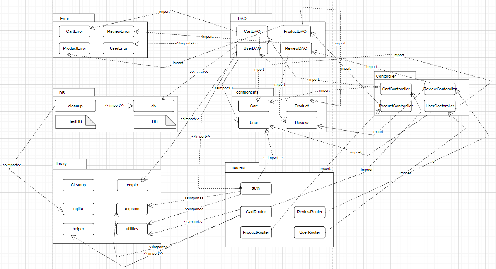
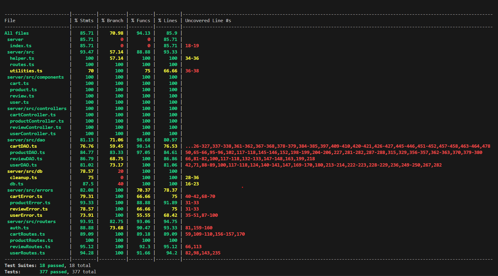

# Test Report

The goal of this document is to explain how the application was tested, detailing how the test cases were defined and what they cover

# Contents

- [Test Report](#test-report)
- [Contents](#contents)
- [Dependency graph](#dependency-graph)
- [Integration approach](#integration-approach)
- [Tests](#tests)
- [Coverage](#coverage)
  - [Coverage of FR](#coverage-of-fr)
  - [Coverage white box](#coverage-white-box)

# Dependency graph

  

# Integration approach

    We adopted a mixed approach. 

    Step 1: unit testing of components classes
    Step 2: unit testing of DAO classes and auth
    Step 3: unit testing of controllers and routes
    Step 4: integration tests for Routes, controllers and DAO
    Step 5: System tests from the Front-end Postman
    Step 6: API testing using PostMan

# Tests

|Test n.| Test case name | Object(s) tested | Test level | Technique used |
|:-:| :------------: | :--------------: | :--------: | :------------: |
|   |                |                  |            |                |
1|it should return 200, successfull login|Login - POST ezelectronics/sessions|Unit|WB/ Statement Coverage
2|it should return error 422, wrong body content - empty username|Login - POST ezelectronics/sessions|Unit|WB/ Statement Coverage
3|it should return error 422, wrong body content - empty password|Login - POST ezelectronics/sessions|Unit|WB/ Statement Coverage
4|it should return error 401, user does not exist|Login - POST ezelectronics/sessions|Unit|WB/ Statement Coverage
5|it should return error 401, password does not match|Login - POST ezelectronics/sessions|Unit|WB/ Statement Coverage
6|Logout performed - 200|Logout - DELETE ezelectronics/sessions/current|Unit|WB/ Statement Coverage
7|Logout error - 401, user not authenticated|Logout - DELETE ezelectronics/sessions/current|Unit|WB/ Statement Coverage
8|current session performed - 200|Session - GET ezelectronics/sessions/current|Unit|WB/ Statement Coverage
9|current session error - 401, user not authenticated|Session - GET ezelectronics/sessions/current|Unit|WB/ Statement Coverage
10|It should return a 200 success code|POST ezelectronics/users|Unit|WB/ Statement Coverage
11|It should return a 409 error code, user already exist|POST ezelectronics/users|Unit|WB/ Statement Coverage
12|It should return a 422 error code, wrong body content|POST ezelectronics/users|Unit|WB/ Statement Coverage
13|It should return a 422 error code, wrong body content|POST ezelectronics/users|Unit|WB/ Statement Coverage
14|It should return a 422 error code, wrong body content|POST ezelectronics/users|Unit|WB/ Statement Coverage
15|It should return a 422 error code, wrong body content|POST ezelectronics/users|Unit|WB/ Statement Coverage
16|It should return all the users - 3|GET ezelectronics/users|Unit|WB/ Statement Coverage
17|It should fail 401, not admin|GET ezelectronics/users|Unit|WB/ Statement Coverage
18|It should return 3 manager|GET ezelectronics/users/roles/:role|Unit|WB/ Statement Coverage
19|It should return 0 customer|GET ezelectronics/users/roles/:role|Unit|WB/ Statement Coverage
20|It should return 422 error, wrong paramter|GET ezelectronics/users/roles/:role|Unit|WB/ Statement Coverage
21|It should return 401 error, not admin|GET ezelectronics/users/roles/:role|Unit|WB/ Statement Coverage
22|It should found 1 user - Customer searching itself|GET ezelectronics/users/:username|Unit|WB/ Statement Coverage
23|It should throw an error 401 - Customer searching another user|GET ezelectronics/users/:username|Unit|WB/ Statement Coverage
24|It should throw an error 404 - Username not found|GET ezelectronics/users/:username|Unit|WB/ Statement Coverage
25|It should return true - User deletes itself|DELETE ezelectronics/users/:username|Unit|WB/ Statement Coverage
26|It should throw an error 404 - Admin tries to delete a non-existet user|DELETE ezelectronics/users/:username|Unit|WB/ Statement Coverage
27|It should throw an error 401 - Admin tries to delete another admin|DELETE ezelectronics/users/:username|Unit|WB/ Statement Coverage
28|It should throw an error 401 - Non Admin tries to delete another user|DELETE ezelectronics/users/:username|Unit|WB/ Statement Coverage
29|It should return true - every non Admin user is deleted|DELETE ezelectronics/users|Unit|WB/ Statement Coverage
30|It should return an user - User updates its info|PATCH ezelectronics/users/:username|Unit|WB/ Statement Coverage
31|It should return an user - Admin updates other non admin information|PATCH ezelectronics/users/:username|Unit|WB/ Statement Coverage
32|It should return an error 401 - User try to update non existent user|PATCH ezelectronics/users/:username|Unit|WB/ Statement Coverage
33|It should return an error - User try to update another existent user|PATCH ezelectronics/users/:username|Unit|WB/ Statement Coverage
34|It should return an error - User try to update its own info but the birthdate is after the current day|PATCH ezelectronics/users/:username|Unit|WB/ Statement Coverage
35|It should return an error 422 - Wrong body content 1|PATCH ezelectronics/users/:username|Unit|WB/ Statement Coverage
36|It should return an error 422 - Wrong body content 2|PATCH ezelectronics/users/:username|Unit|WB/ Statement Coverage
37|It should return an error 422 - Wrong body content 3|PATCH ezelectronics/users/:username|Unit|WB/ Statement Coverage
38|code 200 success|POST ezelectronics/products|Unit|WB/ Statement Coverage
39|error 409, model already exists|POST ezelectronics/products|Unit|WB/ Statement Coverage
40|error 400, arrival date wrong|POST ezelectronics/products|Unit|WB/ Statement Coverage
41|code 200 success, without passing arrivalDate|POST ezelectronics/products|Unit|WB/ Statement Coverage
42|code 200 success|PATCH ezelectronics/products/:model|Unit|WB/ Statement Coverage
43|error 404, model already exists|PATCH ezelectronics/products/:model|Unit|WB/ Statement Coverage
44|error 400, changeDate is after the current date|PATCH ezelectronics/products/:model|Unit|WB/ Statement Coverage
45|code 200 success, without passing changeDate|PATCH ezelectronics/products/:model|Unit|WB/ Statement Coverage
46|error 401, no logged in|PATCH ezelectronics/products/:model|Unit|WB/ Statement Coverage
47|code 200 success|PATCH ezelectronics/products/:model/sell|Unit|WB/ Statement Coverage
48|error 404, model not found|PATCH ezelectronics/products/:model/sell|Unit|WB/ Statement Coverage
49|error 400, selling date is wrong|PATCH ezelectronics/products/:model/sell|Unit|WB/ Statement Coverage
50|code 200 success, without passing changeDate|PATCH ezelectronics/products/:model/sell|Unit|WB/ Statement Coverage
51|error 401, no logged in|PATCH ezelectronics/products/:model/sell|Unit|WB/ Statement Coverage
52|error 409, model not available|PATCH ezelectronics/products/:model/sell|Unit|WB/ Statement Coverage
53|error 409, available quantity of model is lower than the requested quantity|PATCH ezelectronics/products/:model/sell|Unit|WB/ Statement Coverage
54|code 200|GET ezelectronics/products|Unit|WB/ Statement Coverage
55|error 422, wrong parameters|GET ezelectronics/products|Unit|WB/ Statement Coverage
56|code 404, model does not exist|GET ezelectronics/products|Unit|WB/ Statement Coverage
57|code 401, no logged in|GET ezelectronics/products|Unit|WB/ Statement Coverage
58|code 200, returned all product|GET ezelectronics/products|Unit|WB/ Statement Coverage
59|code 200|GET ezelectronics/products/available|Unit|WB/ Statement Coverage
60|error 422, wrong parameters|GET ezelectronics/products/available|Unit|WB/ Statement Coverage
61|code 404, model does not exist|GET ezelectronics/products/available|Unit|WB/ Statement Coverage
62|code 401, no logged in|GET ezelectronics/products/available|Unit|WB/ Statement Coverage
63|code 200, returned all product|GET ezelectronics/products/available|Unit|WB/ Statement Coverage
64|success 200|DELETE ezelectronics/products/:model|Unit|WB/ Statement Coverage
65|code 404, model does not exist|DELETE ezelectronics/products/:model|Unit|WB/ Statement Coverage
66|code 401, no logged in|DELETE ezelectronics/products/:model|Unit|WB/ Statement Coverage
67|success 200|DELETE ezelectronics/products|Unit|WB/ Statement Coverage
68|code 404, model does not exist|DELETE ezelectronics/products|Unit|WB/ Statement Coverage
69|code 401, no logged in|DELETE ezelectronics/products|Unit|WB/ Statement Coverage
70|code 200, current cart returned|GET ezelectronics/carts|Unit|WB/ Statement Coverage
71|code 401, not customer|GET ezelectronics/carts|Unit|WB/ Statement Coverage
72|success 200|POST ezelectronics/carts|Unit|WB/ Statement Coverage
73|error 422, wrong body content|POST ezelectronics/carts|Unit|WB/ Statement Coverage
74|error 401, no logged|POST ezelectronics/carts|Unit|WB/ Statement Coverage
75|error 404, model not found|POST ezelectronics/carts|Unit|WB/ Statement Coverage
76|error 409, model not available|POST ezelectronics/carts|Unit|WB/ Statement Coverage
77|success 200|PATCH ezelectronics/carts|Unit|WB/ Statement Coverage
78|error 404, no unpaid cart|PATCH ezelectronics/carts|Unit|WB/ Statement Coverage
79|error 400, empty cart|PATCH ezelectronics/carts|Unit|WB/ Statement Coverage
80|error 409, quantity model 0|PATCH ezelectronics/carts|Unit|WB/ Statement Coverage
81|error 409, available quantity below|PATCH ezelectronics/carts|Unit|WB/ Statement Coverage
82|error 401, no logged in|PATCH ezelectronics/carts|Unit|WB/ Statement Coverage
83|200 success code|GET ezelectronics/carts/history|Unit|WB/ Statement Coverage
84|error 401, no logged in|GET ezelectronics/carts/history|Unit|WB/ Statement Coverage
85|sucess 200|DELETE ezelectronics/carts/products/:model|Unit|WB/ Statement Coverage
86|error 404, product not found|DELETE ezelectronics/carts/products/:model|Unit|WB/ Statement Coverage
87|error 404, no cart or product its not in the cart|DELETE ezelectronics/carts/products/:model|Unit|WB/ Statement Coverage
88|error 404, product not in cart|DELETE ezelectronics/carts/products/:model|Unit|WB/ Statement Coverage
89|error 401, no logged in|DELETE ezelectronics/carts/products/:model|Unit|WB/ Statement Coverage
90|success 200 |DELETE ezelectronics/carts/current|Unit|WB/ Statement Coverage
91|error 404, no cart or product its not in the cart|DELETE ezelectronics/carts/current|Unit|WB/ Statement Coverage
92|error 401, no logged in|DELETE ezelectronics/carts/current|Unit|WB/ Statement Coverage
93|sucess 200|DELETE ezelectronics/carts|Unit|WB/ Statement Coverage
94|error 401, no logged in|DELETE ezelectronics/carts|Unit|WB/ Statement Coverage
95|sucess 200|GET ezelectronics/carts/all|Unit|WB/ Statement Coverage
96|error 401, no logged in|GET ezelectronics/carts/all|Unit|WB/ Statement Coverage
97|It should return a 200 success code|POST ezelectronics/reviews/:model|Unit|WB/ Statement Coverage
98|It should return a 404 error code, model not in database|POST ezelectronics/reviews/:model|Unit|WB/ Statement Coverage
99|It should return a 409 error code, existing review|POST ezelectronics/reviews/:model|Unit|WB/ Statement Coverage
100|It should return a 422 error code, wrong parameters 1|POST ezelectronics/reviews/:model|Unit|WB/ Statement Coverage
101|It should return a 422 error code, wrong parameters 2|POST ezelectronics/reviews/:model|Unit|WB/ Statement Coverage
102|It should return a 200 success code, empty comment|POST ezelectronics/reviews/:model|Unit|WB/ Statement Coverage
103|it should return 200 - specific model reviews returned|GET ezelectronics/reviews/:model|Unit|WB/ Statement Coverage
104|it should return 401 - user not logged|GET ezelectronics/reviews/:model|Unit|WB/ Statement Coverage
105|it should return 200 - specific model reviews returned|DELETE ezelectronics/reviews/:model|Unit|WB/ Statement Coverage
106|it should return 401 - user not logged|DELETE ezelectronics/reviews/:model|Unit|WB/ Statement Coverage
107|It should return a 404 error code, model not in database|DELETE ezelectronics/reviews/:model|Unit|WB/ Statement Coverage
108|It should return a 404 error code, no review in db|DELETE ezelectronics/reviews/:model|Unit|WB/ Statement Coverage
109|it should return 200 - specific model reviews deleted|DELETE ezelectronics/reviews/:model/all|Unit|WB/ Statement Coverage
110|it should return 401 - user not logged|DELETE ezelectronics/reviews/:model/all|Unit|WB/ Statement Coverage
111|It should return a 404 error code, model not in database|DELETE ezelectronics/reviews/:model/all|Unit|WB/ Statement Coverage
112|it should return 200 - all reviews deleted|DELETE ezelectronics/reviews|Unit|WB/ Statement Coverage
113|it should return 401 - user not logged|DELETE ezelectronics/reviews|Unit|WB/ Statement Coverage
114|It should return true|userController.createUser|Unit|WB/ Statement Coverage
115|Error 409, user already registered|userController.createUser|Unit|WB/ Statement Coverage
116|Error 50X, database error|userController.createUser|Unit|WB/ Statement Coverage
117|It should return all the users - 3|userController.getUsers|Unit|WB/ Statement Coverage
118|It should return an empty array|userController.getUsers|Unit|WB/ Statement Coverage
119|It should return 3 manager|userController.getUsersByRole|Unit|WB/ Statement Coverage
120|It should return 2 customer|userController.getUsersByRole|Unit|WB/ Statement Coverage
121|It should return 3 admin|userController.getUsersByRole|Unit|WB/ Statement Coverage
122|It should return 0 customer|userController.getUsersByRole|Unit|WB/ Statement Coverage
123|It should return 0 manager|userController.getUsersByRole|Unit|WB/ Statement Coverage
124|It should found 1 user - Customer searching itself|userController.getUserByUsername|Unit|WB/ Statement Coverage
125|It should throw an error - Customer searching another user|userController.getUserByUsername|Unit|WB/ Statement Coverage
126|It should found 1 user - Admin searching a different user|userController.getUserByUsername|Unit|WB/ Statement Coverage
127|It should throw an error - Username not found|userController.getUserByUsername|Unit|WB/ Statement Coverage
128|It should return true - User deletes itself|userController.deleteUser|Unit|WB/ Statement Coverage
129|It should throw an error - Admin tries to delete a non-existet user|userController.deleteUser|Unit|WB/ Statement Coverage
130|It should throw an error - Admin tries to delete another admin|userController.deleteUser|Unit|WB/ Statement Coverage
131|It should throw an error - Non Admin tries to delete another user|userController.deleteUser|Unit|WB/ Statement Coverage
132|It should return true - every non Admin user is deleted|userController.deleteAll|Unit|WB/ Statement Coverage
133|It should return an user - User updates its info|userController.updateUserInfo|Unit|WB/ Statement Coverage
134|It should return an user - Admin updates other non admin information|userController.updateUserInfo|Unit|WB/ Statement Coverage
135|It should return an error - User try to update non existent user|userController.updateUserInfo|Unit|WB/ Statement Coverage
136|It should return an error - User try to update another existent user|userController.updateUserInfo|Unit|WB/ Statement Coverage
137|It should return an error - User try to update its own info but the birthdate is after the current day|userController.updateUserInfo|Unit|WB/ Statement Coverage
138|code 200 success|productController.registerProducts|Unit|WB/ Statement Coverage
139|code 200 success, without passing arrivalDate|productController.registerProducts|Unit|WB/ Statement Coverage
140|code 200 success|productController.changeProductQuantity|Unit|WB/ Statement Coverage
141|code 200 success, without passing arrivalDate|productController.changeProductQuantity|Unit|WB/ Statement Coverage
142|code 200 success|productController.sellProduct|Unit|WB/ Statement Coverage
143|code 200 success, without passing arrivalDate|productController.sellProduct|Unit|WB/ Statement Coverage
144|code 200 success|productController.getProducts|Unit|WB/ Statement Coverage
145|code 200 success|productController.getAvailableProducts|Unit|WB/ Statement Coverage
146|code 200 success|productController.deleteAllProducts|Unit|WB/ Statement Coverage
147|code 200 success|productController.deleteProduct|Unit|WB/ Statement Coverage
148|code 200, current cart returned|cartController.getCart|Unit|WB/ Statement Coverage
149|code 200, model added|cartController.addToCart|Unit|WB/ Statement Coverage
150|code 404, model does not exist|cartController.addToCart|Unit|WB/ Statement Coverage
151|code 409, model not available|cartController.addToCart|Unit|WB/ Statement Coverage
152|code 200, checked out|cartController.checkoutCart|Unit|WB/ Statement Coverage
153|code 200, cart history returned|cartController.getCustomerCarts|Unit|WB/ Statement Coverage
154|code 200, product removed|cartController.removeProductFromCart|Unit|WB/ Statement Coverage
155|code 200, cart cleared|cartController.clearCart|Unit|WB/ Statement Coverage
156|code 200,all carts deleted|cartController.deleteAllCarts|Unit|WB/ Statement Coverage
157|code 200, carts returned|cartController.getAllCarts|Unit|WB/ Statement Coverage
158|Review added|reviewController.AddReview|Unit|WB/ Statement Coverage
159|Error 404, Product not in database|reviewController.AddReview|Unit|WB/ Statement Coverage
160|Error 409, Product not in database|reviewController.AddReview|Unit|WB/ Statement Coverage
161|Reviews got successfully|reviewController.getProductReviews|Unit|WB/ Statement Coverage
162|Deletion done|reviewController.deleteReview|Unit|WB/ Statement Coverage
163|Error 404, Product not in database|reviewController.deleteReview|Unit|WB/ Statement Coverage
164|Error 404, Product not in database|reviewController.deleteReview|Unit|WB/ Statement Coverage
165|Deletion all done|reviewController.deleteReviewsOfProduct|Unit|WB/ Statement Coverage
166|Error 404, Product not in database|reviewController.deleteReviewsOfProduct|Unit|WB/ Statement Coverage
167|Deletion all done|reviewController.deleteAllReviews|Unit|WB/ Statement Coverage
168|It should resolve true|userDAO.createUser|Unit|WB/ Statement Coverage
169|User already registered|userDAO.createUser|Unit|WB/ Statement Coverage
170|It should return all the users - 3|userDAO.getAllUsers|Unit|WB/ Statement Coverage
171|It should return an empty array|userDAO.getAllUsers|Unit|WB/ Statement Coverage
172|It should return 3 manager|userDAO.getUserByRole|Unit|WB/ Statement Coverage
173|It should return 2 customer|userDAO.getUserByRole|Unit|WB/ Statement Coverage
174|It should return 3 admin|userDAO.getUserByRole|Unit|WB/ Statement Coverage
175|It should return 0 customer|userDAO.getUserByRole|Unit|WB/ Statement Coverage
176|It should return 0 manager|userDAO.getUserByRole|Unit|WB/ Statement Coverage
177|It should found 1 user - Customer searching itself|userDAO.getUserByCustomUsername|Unit|WB/ Statement Coverage
178|It should throw an error - Customer searching another user|userDAO.getUserByCustomUsername|Unit|WB/ Statement Coverage
179|It should throw an error - Username not found|userDAO.getUserByCustomUsername|Unit|WB/ Statement Coverage
180|It should found 1 user - Admin searching a different user|userDAO.getUserByCustomUsername|Unit|WB/ Statement Coverage
181|It should return true - User deletes itself|userDAO.deleteUser|Unit|WB/ Statement Coverage
182|It should return true - Admin deletes non-admin user|userDAO.deleteUser|Unit|WB/ Statement Coverage
183|It should throw an error - Admin tries to delete a non-existet user|userDAO.deleteUser|Unit|WB/ Statement Coverage
184|It should throw an error - Admin tries to delete another admin|userDAO.deleteUser|Unit|WB/ Statement Coverage
185|It should throw an error - Non Admin tries to delete another user|userDAO.deleteUser|Unit|WB/ Statement Coverage
186|It should return true - every non Admin user is deleted|userDAO.deleteAllUsers|Unit|WB/ Statement Coverage
187|It should return an user - User updates its info|userDAO.updateUserInfo|Unit|WB/ Statement Coverage
188|It should return an user - Admin updates other non admin information|userDAO.updateUserInfo|Unit|WB/ Statement Coverage
189|It should return an error - User try to update non existent user|userDAO.updateUserInfo|Unit|WB/ Statement Coverage
190|It should return an error - User try to update another existent user|userDAO.updateUserInfo|Unit|WB/ Statement Coverage
191|It should return an error - User try to update its own info but the birthdate is after the current day|userDAO.updateUserInfo|Unit|WB/ Statement Coverage
192|It should return true - Auth succedded|userDAO.getIsUserAuthenticated|Unit|WB/ Statement Coverage
193|It should return false - Auth failed, no matching password|userDAO.getIsUserAuthenticated|Unit|WB/ Statement Coverage
194|It should return false - Auth failed, no matching username|userDAO.getIsUserAuthenticated|Unit|WB/ Statement Coverage
195|It should found 1 user |userDAO.SearchByUsername|Unit|WB/ Statement Coverage
196|It should throw an error - Username not found|userDAO.SearchByUsername|Unit|WB/ Statement Coverage
197|arrivalDate > today -> SellingDateError|productDAO.Register Product tests|Unit|WB/ Statement Coverage
198|arrivalDate < today -> insertDone|productDAO.Register Product tests|Unit|WB/ Statement Coverage
199|first get: ProductNotFoundError|productDAO.changeProductQuantity|Unit|WB/ Statement Coverage
200|first get: changeDate == today but arrivalDateDt>changeDateDt=sysdate -> ChangeDateError|productDAO.changeProductQuantity|Unit|WB/ Statement Coverage
201|first get: changeDate is defined but > sysdate|productDAO.changeProductQuantity|Unit|WB/ Statement Coverage
202|changeDate==today and arrivalDate<changeDateDt=sysdate -> enter UPDATE -> resolve true|productDAO.changeProductQuantity|Unit|WB/ Statement Coverage
203|case grouping == null and category!=null -> WrongParametersError|productDAO.getAvailableProduct|Unit|WB/ Statement Coverage
204|case grouping == null and model!=null -> WrongParametersError|productDAO.getAvailableProduct|Unit|WB/ Statement Coverage
205|case grouping == category and model!=null -> WrongParametersError|productDAO.getAvailableProduct|Unit|WB/ Statement Coverage
206|case grouping == category and category==null -> WrongParametersError|productDAO.getAvailableProduct|Unit|WB/ Statement Coverage
207|case grouping == model and category!=null -> WrongParametersError|productDAO.getAvailableProduct|Unit|WB/ Statement Coverage
208|case grouping == model and model==null -> WrongParametersError|productDAO.getAvailableProduct|Unit|WB/ Statement Coverage
209|enter select -> rows emptyt -> ProductNotFoundError|productDAO.getAvailableProduct|Unit|WB/ Statement Coverage
210|enter select and grouping=model but model not available -> return []|productDAO.getAvailableProduct|Unit|WB/ Statement Coverage
211|enter select and it works (it makes no sense to try all cases of response of DB in a mocked unit tests)|productDAO.getAvailableProduct|Unit|WB/ Statement Coverage
212|case grouping == null and category!=null -> WrongParametersError|productDAO.getProducts|Unit|WB/ Statement Coverage
213|case grouping == null and model!=null -> WrongParametersError|productDAO.getProducts|Unit|WB/ Statement Coverage
214|case grouping == category and model!=null -> WrongParametersError|productDAO.getProducts|Unit|WB/ Statement Coverage
215|case grouping == category and category==null -> WrongParametersError|productDAO.getProducts|Unit|WB/ Statement Coverage
216|case grouping == model and category!=null -> WrongParametersError|productDAO.getProducts|Unit|WB/ Statement Coverage
217|case grouping == model and model==null -> WrongParametersError|productDAO.getProducts|Unit|WB/ Statement Coverage
218|enter select -> rows emptyt -> ProductNotFoundError|productDAO.getProducts|Unit|WB/ Statement Coverage
219|enter select and it works (it makes no sense to try all cases of response of DB in a mocked unit tests)|productDAO.getProducts|Unit|WB/ Statement Coverage
220|product deleted|productDAO.deleteProduct|Unit|WB/ Statement Coverage
221|db get error #1|productDAO.deleteProduct|Unit|WB/ Statement Coverage
222|Db get error #2|productDAO.deleteProduct|Unit|WB/ Statement Coverage
223|cart updated after deletion|productDAO.deleteProduct|Unit|WB/ Statement Coverage
224|Db error, #3|productDAO.deleteProduct|Unit|WB/ Statement Coverage
225|all products deleted|productDAO.deleteAllProducts|Unit|WB/ Statement Coverage
226|db error|productDAO.deleteAllProducts|Unit|WB/ Statement Coverage
227|product sold in shop|productDAO.sellProduct|Unit|WB/ Statement Coverage
228|quantity error number sold >  quantity in stock|productDAO.sellProduct|Unit|WB/ Statement Coverage
229|quantity error, stock is 0|productDAO.sellProduct|Unit|WB/ Statement Coverage
230|product not found|productDAO.sellProduct|Unit|WB/ Statement Coverage
231|selling date error, is > today|productDAO.sellProduct|Unit|WB/ Statement Coverage
232|selling date error, is < arrivalDate|productDAO.sellProduct|Unit|WB/ Statement Coverage
233|Product exists, cart exists, row exists|cartDAO.addProduct|Unit|WB/ Statement Coverage
234|Product exists, cart exists, row doesnt exists|cartDAO.addProduct|Unit|WB/ Statement Coverage
235|Product exists, cart does not exists|cartDAO.addProduct|Unit|WB/ Statement Coverage
236|Product doesnt exist: ProductNotFoundError!|cartDAO.addProduct|Unit|WB/ Statement Coverage
237|Product is not available: EmptyProductStockError!|cartDAO.addProduct|Unit|WB/ Statement Coverage
238|rows empty|cartDAO.getCurrentCart|Unit|WB/ Statement Coverage
239|rows exists|cartDAO.getCurrentCart|Unit|WB/ Statement Coverage
240|first select: CartNotFoundError|cartDAO.checkoutCart|Unit|WB/ Statement Coverage
241|second select: EmptyCartError|cartDAO.checkoutCart|Unit|WB/ Statement Coverage
242|second select: EmptyProductStockError|cartDAO.checkoutCart|Unit|WB/ Statement Coverage
243|second select: LowProductStockError|cartDAO.checkoutCart|Unit|WB/ Statement Coverage
244|update statement: return true|cartDAO.checkoutCart|Unit|WB/ Statement Coverage
245|first case: rows empty|cartDAO.getCustomerCart|Unit|WB/ Statement Coverage
246|second case: rows present|cartDAO.getCustomerCart|Unit|WB/ Statement Coverage
247|first case: first rows empty|cartDAO.getAllCarts|Unit|WB/ Statement Coverage
248|second case: rows present|cartDAO.getAllCarts|Unit|WB/ Statement Coverage
249|first select test: expect ProductNotFoundError|cartDAO.removeProductFromCart|Unit|WB/ Statement Coverage
250|second select test: expect CartNotFoundError, []|cartDAO.removeProductFromCart|Unit|WB/ Statement Coverage
251|third select test: expect EmptyCart404Error, |cartDAO.removeProductFromCart|Unit|WB/ Statement Coverage
252|third select test: expect ProductNotInCartError, productsNumber==0|cartDAO.removeProductFromCart|Unit|WB/ Statement Coverage
253|qt>1, update test|cartDAO.removeProductFromCart|Unit|WB/ Statement Coverage
254|qt==1, delete test|cartDAO.removeProductFromCart|Unit|WB/ Statement Coverage
255|first select: rows empty -> CartNotFoundError|cartDAO.clearUserCart|Unit|WB/ Statement Coverage
256|correct run: double delete -> resolve true|cartDAO.clearUserCart|Unit|WB/ Statement Coverage
257|only one test: return true|cartDAO.deleteAllCarts|Unit|WB/ Statement Coverage
258|Review added|reviewDAO.addReview|Unit|WB/ Statement Coverage
259|Error 404 - product not in database|reviewDAO.addReview|Unit|WB/ Statement Coverage
260|Error 409 - review already published|reviewDAO.addReview|Unit|WB/ Statement Coverage
261|Database error add review 1|reviewDAO.addReview|Unit|WB/ Statement Coverage
262|Database error add review 2|reviewDAO.addReview|Unit|WB/ Statement Coverage
263|Database error add review 3|reviewDAO.addReview|Unit|WB/ Statement Coverage
264|get reviews|reviewDAO.getProductReviews|Unit|WB/ Statement Coverage
265|Review deleted|reviewDAO.deleteReview|Unit|WB/ Statement Coverage
266|Error 404 - model does not exist|reviewDAO.deleteReview|Unit|WB/ Statement Coverage
267|Error 404 - User has no review|reviewDAO.deleteReview|Unit|WB/ Statement Coverage
268|Reviews deleted|reviewDAO.deleteReviewsOfProduct|Unit|WB/ Statement Coverage
269|Error 404 - model does not exist|reviewDAO.deleteReviewsOfProduct|Unit|WB/ Statement Coverage
270|Database error delete all reviews 1 product - 1|reviewDAO.deleteReviewsOfProduct|Unit|WB/ Statement Coverage
271|Database error delete all reviews 1 product - 2|reviewDAO.deleteReviewsOfProduct|Unit|WB/ Statement Coverage
272|Deleted all reviews|reviewDAO.deleteAllReviews|Unit|WB/ Statement Coverage
273|Database error|reviewDAO.deleteAllReviews|Unit|WB/ Statement Coverage
274|It should return a 200 success code and create a new user|POST /users|Integration|BB/ Eq Partitioning
275|It should return a 422 error code if at least one request body parameter is empty/missing|POST /users|Integration|BB/ Eq Partitioning
276|It should return a 409 error the username is already in the database|POST /users|Integration|BB/ Eq Partitioning
277|It should return an array of users|GET /users|Integration|BB/ Eq Partitioning
278|It should return a 401 error code if the user is not an Admin|GET /users|Integration|BB/ Eq Partitioning
279|It should return an array of users with a specific role|GET /users/roles/:role|Integration|BB/ Eq Partitioning
280|It should fail if the role is not valid|GET /users/roles/:role|Integration|BB/ Eq Partitioning
281|It should return the user with the specific username|GET /users/:username|Integration|BB/ Eq Partitioning
282|It should return 404 if the username is not in database|GET /users/:username|Integration|BB/ Eq Partitioning
283|It should return 401 if customer search another user|GET /users/:username|Integration|BB/ Eq Partitioning
284|It should delete the user with the specific username|DELETE /users/:username|Integration|BB/ Eq Partitioning
285|It should return 404 if the username is not in database|DELETE /users/:username|Integration|BB/ Eq Partitioning
286|It should return 401 if customer deletes another user|DELETE /users/:username|Integration|BB/ Eq Partitioning
287|It should return 401 if customer deletes another user|DELETE /users/:username|Integration|BB/ Eq Partitioning
288|It should update the user information|PATCH ezelectronics/users/:username|Integration|BB/ Eq Partitioning
289|It should return 404 if the username is not in database|PATCH ezelectronics/users/:username|Integration|BB/ Eq Partitioning
290|It should return 401 if user is not Admin and updates another user|PATCH ezelectronics/users/:username|Integration|BB/ Eq Partitioning
291|It should return 400 if birthdate is after today|PATCH ezelectronics/users/:username|Integration|BB/ Eq Partitioning
292|It should return a 422 error code if at least one request body parameter is empty/missing|PATCH ezelectronics/users/:username|Integration|BB/ Eq Partitioning
293|It should delete all the users|DELETE ezelectronics/users|Integration|BB/ Eq Partitioning
294|It should return error 401, no logged in|DELETE ezelectronics/users|Integration|BB/ Eq Partitioning
295|Product added, code returned 200|POST ezelectronics/products|Integration|BB/ Eq Partitioning
296|Product already present, error 409|POST ezelectronics/products|Integration|BB/ Eq Partitioning
297|Product already present, error 400|POST ezelectronics/products|Integration|BB/ Eq Partitioning
298|It should return a 422 error code if at least one request body parameter is empty/missing|POST ezelectronics/products|Integration|BB/ Eq Partitioning
299|Quantity increased, code 200|PATCH ezelectronics/products/:model|Integration|BB/ Eq Partitioning
300|Product already present, error 404|PATCH ezelectronics/products/:model|Integration|BB/ Eq Partitioning
301|It should return a 400 error if changeDate is after the current date|PATCH ezelectronics/products/:model|Integration|BB/ Eq Partitioning
302|It should return a 400 error if changeDate is before the products arrivalDate|PATCH ezelectronics/products/:model|Integration|BB/ Eq Partitioning
303|It should return a 422 error code if at least one request body parameter is empty/missing|PATCH ezelectronics/products/:model|Integration|BB/ Eq Partitioning
304|Quantity increased, code 200|PATCH ezelectronics/products/:model/sell|Integration|BB/ Eq Partitioning
305|It should return a 404 error if model does not represent a product in the database|PATCH ezelectronics/products/:model/sell|Integration|BB/ Eq Partitioning
306|It should return a 400 error if sellingDate is after the current date|PATCH ezelectronics/products/:model/sell|Integration|BB/ Eq Partitioning
307|It should return a 400 error if sellingDate is before the products arrivalDate|PATCH ezelectronics/products/:model/sell|Integration|BB/ Eq Partitioning
308|It should return a 409 error if the available quantity of model is lower than the requested quantity|PATCH ezelectronics/products/:model/sell|Integration|BB/ Eq Partitioning
309|It should return a 409 error if model represents a product whose available quantity is 0|PATCH ezelectronics/products/:model/sell|Integration|BB/ Eq Partitioning
310|It should return a 422 error code if at least one request body parameter is empty/missing|PATCH ezelectronics/products/:model/sell|Integration|BB/ Eq Partitioning
311|All Products in database returned|GET ezelectronics/products|Integration|BB/ Eq Partitioning
312|All the smartphones in database returned|GET ezelectronics/products|Integration|BB/ Eq Partitioning
313|code 404, model does not exist|GET ezelectronics/products|Integration|BB/ Eq Partitioning
314|It should return a 422 error code if at least one request body parameter is empty/missing|GET ezelectronics/products|Integration|BB/ Eq Partitioning
315|All Products in database returned|GET ezelectronics/products/available|Integration|BB/ Eq Partitioning
316|All the smartphones in database returned|GET ezelectronics/products/available|Integration|BB/ Eq Partitioning
317|code 404, model does not exist|GET ezelectronics/products/available|Integration|BB/ Eq Partitioning
318|It should return a 422 error code if at least one request body parameter is empty/missing|GET ezelectronics/products/available|Integration|BB/ Eq Partitioning
319|Product deleted, error 200|DELETE ezelectronics/products/:model|Integration|BB/ Eq Partitioning
320|code 404, model does not exist|DELETE ezelectronics/products/:model|Integration|BB/ Eq Partitioning
321|code 401, unauthorized|DELETE ezelectronics/products/:model|Integration|BB/ Eq Partitioning
322|Product deleted, error 200|DELETE ezelectronics/products|Integration|BB/ Eq Partitioning
323|error 401, unauthorized|DELETE ezelectronics/products|Integration|BB/ Eq Partitioning
324|It should return 200, review added|POST ezelectronics/reviews/:model|Integration|BB/ Eq Partitioning
325|It should return 404, review added|POST ezelectronics/reviews/:model|Integration|BB/ Eq Partitioning
326|It should return 409, review already presents|POST ezelectronics/reviews/:model|Integration|BB/ Eq Partitioning
327|It should return a 422 error code if at least one request body parameter is empty/missing|POST ezelectronics/reviews/:model|Integration|BB/ Eq Partitioning
328|It should return 200, reviews got|GET ezelectronics/reviews/:model|Integration|BB/ Eq Partitioning
329|It should return 200, reviews got|GET ezelectronics/reviews/:model|Integration|BB/ Eq Partitioning
330|It should return 401, not authorized|GET ezelectronics/reviews/:model|Integration|BB/ Eq Partitioning
331|It should return 200, reviews deleted|DELETE ezelectronics/reviews/:model|Integration|BB/ Eq Partitioning
332|It should return 404, model not exists|DELETE ezelectronics/reviews/:model|Integration|BB/ Eq Partitioning
333|It should return a 404 error if the current user does not have a review for the product identified by model|DELETE ezelectronics/reviews/:model|Integration|BB/ Eq Partitioning
334|It should return 401, not authorized|DELETE ezelectronics/reviews/:model|Integration|BB/ Eq Partitioning
335|It should return 200, reviews deleted|DELETE ezelectronics/reviews/:model/all|Integration|BB/ Eq Partitioning
336|It should return 404, model not exists|DELETE ezelectronics/reviews/:model/all|Integration|BB/ Eq Partitioning
337|It should return 401, not authorized|DELETE ezelectronics/reviews/:model/all|Integration|BB/ Eq Partitioning
338|It should return 200, all reviews deleted|DELETE ezelectronics/reviews/|Integration|BB/ Eq Partitioning
339|It should return 401, not authorized|DELETE ezelectronics/reviews/|Integration|BB/ Eq Partitioning
340|Unhautorized == 401|GET ezelectronics/carts |Integration|BB/ Eq Partitioning
341|No cart present -> cost==0, no products|GET ezelectronics/carts |Integration|BB/ Eq Partitioning
342|It should get the product|GET ezelectronics/carts |Integration|BB/ Eq Partitioning
343|Cart exists but is bought -> cost==0, no products|GET ezelectronics/carts |Integration|BB/ Eq Partitioning
344|Login as admin -> 401 error|POST ezelectronics/carts |Integration|BB/ Eq Partitioning
345|model does not exists -> ProductNotFoundError [404]|POST ezelectronics/carts |Integration|BB/ Eq Partitioning
346|qt==0 -> EmptyProductStockError() [409]|POST ezelectronics/carts |Integration|BB/ Eq Partitioning
347|No unpaid cart present -> creates the cart and return it with 1 item|POST ezelectronics/carts |Integration|BB/ Eq Partitioning
348|Cart is present but the added product does not exists -> qt ==1|POST ezelectronics/carts |Integration|BB/ Eq Partitioning
349|Cart is present and the product already exists (2nd test) => qt==2|POST ezelectronics/carts |Integration|BB/ Eq Partitioning
350|Login as admin -> 401 error|PATCH ezelectronics/carts|Integration|BB/ Eq Partitioning
351|not existing cart: CartNotFoundError (customer3) [404]|PATCH ezelectronics/carts|Integration|BB/ Eq Partitioning
352|existing cart but empty: EmptyCartError (customer2, add and remove)  [400]|PATCH ezelectronics/carts |Integration|BB/ Eq Partitioning
353|product with qt==0: EmptyProductStockError [409]|PATCH ezelectronics/carts |Integration|BB/ Eq Partitioning
354|product with qtReq<qtAvail in cart: LowProductStockError [409]]|PATCH ezelectronics/carts |Integration|BB/ Eq Partitioning
355|checkout gone as customer -> getAllCarts as admin and see if cart is bought and products are decreased|PATCH ezelectronics/carts |Integration|BB/ Eq Partitioning
356|Login as admin -> 401 error|GET ezelectronics/carts/history |Integration|BB/ Eq Partitioning
357|Not existing paid cart -> return []|GET ezelectronics/carts/history |Integration|BB/ Eq Partitioning
358|Carts exist -> return Cart with products_in_cart|GET ezelectronics/carts/history |Integration|BB/ Eq Partitioning
359|Login as admin -> 401 error|DELETE ezelectronics/carts/products/:model |Integration|BB/ Eq Partitioning
360|Model does not exists -> ProductNotFoundError [404]|DELETE ezelectronics/carts/products/:model |Integration|BB/ Eq Partitioning
361|There is no unpaid_cart (customer3) -> CartNotFoundError [404]|DELETE ezelectronics/carts/products/:model |Integration|BB/ Eq Partitioning
362|There is an unpaid_cart but is empty (customer2) -> CartNotFoundError [404]|DELETE ezelectronics/carts/products/:model |Integration|BB/ Eq Partitioning
363|Model is not in cart -> ProductNotInCartError [404]|DELETE ezelectronics/carts/products/:model|Integration|BB/ Eq Partitioning
364|2 items in cart, one is deleted successfully|DELETE ezelectronics/carts/products/:model |Integration|BB/ Eq Partitioning
365|2 carts items (1 with qt>1) -> qt reduced successfully|DELETE ezelectronics/carts/products/:model |Integration|BB/ Eq Partitioning
366|Login as admin -> 401 error|DELETE ezelectronics/carts/current |Integration|BB/ Eq Partitioning
367|No unpaid cart present for the customer -> CartNotFoundError [404]|DELETE ezelectronics/carts/current |Integration|BB/ Eq Partitioning
368|Cart cleared -> Verify it si empty and total==0|DELETE ezelectronics/carts/current |Integration|BB/ Eq Partitioning
369|Login as a customer -> 401 error|DELETE ezelectronics/carts |Integration|BB/ Eq Partitioning
370|Carts are deleted successfully|DELETE ezelectronics/carts|Integration|BB/ Eq Partitioning
371|Login as a customer -> 401 error|GET ezelectronics/carts/all |Integration|BB/ Eq Partitioning
372|Get all carts|GET ezelectronics/carts/all|Integration|BB/ Eq Partitioning
373|It should logged out the user|DELETE ezelectronics/sessions/current|Integration|BB/ Eq partitioning
374|Error 401, no logged in|DELETE ezelectronics/sessions/current|Integration|BB/ Eq partitioning
375|It should logged in the user|POST ezelectronics/sessions|Integration|BB/ Eq partitioning
376|Error 401, credential errors|POST ezelectronics/sessions|Integration|BB/ Eq partitioning
377|409 if already existing|POST ezelectronics/users| API | BB/ Eq Partitionin
378|role not existing|POST ezelectronics/users| API | BB/ Eq Partitioning
379|succeed elsewhere|POST ezelectronics/users| API | BB/ Eq Partitioning
380|logged not ad admin|GET ezelectronics/users| API | BB/ Eq Partitioning
381|get all users|GET ezelectronics/users| API | BB/ Eq Partitioning
382|get all users|GET ezelectronics/users| API | BB/ Eq Partitioning
383|user is not admin|GET ezelectronics/users/roles/:role| API | BB/ Eq Partitioning
384|get customers|GET ezelectronics/users/roles/:role| API | BB/ Eq Partitioning
385|get admins|GET ezelectronics/users/roles/:role| API | BB/ Eq Partitioning
386|get manager|GET ezelectronics/users/roles/:role| API | BB/ Eq Partitioning
387|called by a different in user|GET ezelectronics/users/:username| API | BB/ Eq Partitioning
388|called by the logged in user|GET ezelectronics/users/:username| API | BB/ Eq Partitioning
389|called by the admin for not existing user 404 error|GET ezelectronics/users/:username| API | BB/ Eq Partitioning
390|called by the admin for not existing user|GET ezelectronics/users/:username| API | BB/ Eq Partitioning
391|username does not exists 404|DELETE ezelectronics/users/:username| API | BB/ Eq Partitioning
392|called by a not-admin on another user -> 401|DELETE ezelectronics/users/:username| API | BB/ Eq Partitioning
393|called by an admin on another admin -> 401|DELETE ezelectronics/users/:username| API | BB/ Eq Partitioning
394|called by a customer on himself -> works|DELETE ezelectronics/users/:username| API | BB/ Eq Partitioning
395|called by an admin on himself -> works|DELETE ezelectronics/users/:username| API | BB/ Eq Partitioning
396|login as manager|DELETE ezelectronics/users| API | BB/ Eq Partitioning
397|login as admin -> delete successful|DELETE ezelectronics/users| API | BB/ Eq Partitioning
398|pass a null date|PATCH ezelectronics/users/:username| API | BB/ Eq Partitioning
399|user does not exists -> 404 error|PATCH ezelectronics/users/:username| API | BB/ Eq Partitioning
400|username is not the same-> 401 error|PATCH ezelectronics/users/:username| API | BB/ Eq Partitioning
401|birthdate after current date: 400 error|PATCH ezelectronics/users/:username| API | BB/ Eq Partitioning
402|user changes his own data -> execute and get response|PATCH ezelectronics/users/:username| API | BB/ Eq Partitioning
403|admin changes data of another admin -> 401|PATCH ezelectronics/users/:username| API | BB/ Eq Partitioning
404|admin changes another user -> execute and get response|PATCH ezelectronics/users/:username| API | BB/ Eq Partitioning
405|admin changes his data|PATCH ezelectronics/users/:username| API | BB/ Eq Partitioning
406|409 errror if product exists|POST ezelectronics/products| API | BB/ Eq Partitioning
407|409 error when arrivalDate after currentDate|POST ezelectronics/products| API | BB/ Eq Partitioning
408|product correctly added|POST ezelectronics/products| API | BB/ Eq Partitioning
409|error when user is customer|POST ezelectronics/products| API | BB/ Eq Partitioning
410|verify all controls are correct|PATCH ezelectronics/products/:model| API | BB/ Eq Partitioning
411|404 if model doesn't exists|PATCH ezelectronics/products/:model| API | BB/ Eq Partitioning
412|400 if changeDate after currentDate|PATCH ezelectronics/products/:model| API | BB/ Eq Partitioning
413|400 if changeDate before arrivalDate|PATCH ezelectronics/products/:model| API | BB/ Eq Partitioning
414|added qt|PATCH ezelectronics/products/:model| API | BB/ Eq Partitioning
415|controlli generali routes|PATCH ezelectronics/products/:model/sell| API | BB/ Eq Partitioning
416|404 if model doesn't exists|PATCH ezelectronics/products/:model/sell| API | BB/ Eq Partitioning
417|400 if selling date after currentDate|PATCH ezelectronics/products/:model/sell| API | BB/ Eq Partitioning
418|400 if sellingDate before arrivalDate|PATCH ezelectronics/products/:model/sell| API | BB/ Eq Partitioning
419|409 if model available qt ==0|PATCH ezelectronics/products/:model/sell| API | BB/ Eq Partitioning
420|409 if model av qt < req qt|PATCH ezelectronics/products/:model/sell| API | BB/ Eq Partitioning
421|removed with sellingDate null|PATCH ezelectronics/products/:model/sell| API | BB/ Eq Partitioning
422|verify routes|GET ezelectronics/products| API | BB/ Eq Partitioning
423|422 error if grouping is null and category not null|GET ezelectronics/products| API | BB/ Eq Partitioning
424|422 error if grouping is null and model not null|GET ezelectronics/products| API | BB/ Eq Partitioning
425|422 error if grouping is category and category is null|GET ezelectronics/products| API | BB/ Eq Partitioning
426|422 error if grouping is category and model is not null|GET ezelectronics/products| API | BB/ Eq Partitioning
427|422 error if grouping is model and model is null|GET ezelectronics/products| API | BB/ Eq Partitioning
428|422 error if grouping is model and category is not null|GET ezelectronics/products| API | BB/ Eq Partitioning
429|404 eror if model does not exists and you are grouping as model|GET ezelectronics/products| API | BB/ Eq Partitioning
430|getAll products with groupid=null|GET ezelectronics/products| API | BB/ Eq Partitioning
431|getAllProducts of a category with groupind=category|GET ezelectronics/products| API | BB/ Eq Partitioning
432|getAllProducts of a model with groupind=model|GET ezelectronics/products| API | BB/ Eq Partitioning
433|control parameters|GET ezelectronics/products/available| API | BB/ Eq Partitioning
434|verify you get all but not if 0|GET ezelectronics/products/available| API | BB/ Eq Partitioning
435|verify you don't get anything passing a model that has 0 items available|GET ezelectronics/products/available| API | BB/ Eq Partitioning
436|verify you get a model with available qt >0|GET ezelectronics/products/available| API | BB/ Eq Partitioning
437|verify you get all of the category but not if 0|GET ezelectronics/products/available| API | BB/ Eq Partitioning
438|422 error if grouping is null and category not null|GET ezelectronics/products/available| API | BB/ Eq Partitioning
439|422 error if grouping is null and model not null|GET ezelectronics/products/available| API | BB/ Eq Partitioning
440|422 error if grouping is category and category is null|GET ezelectronics/products/available| API | BB/ Eq Partitioning
441|422 error if grouping is category and model is not null|GET ezelectronics/products/available| API | BB/ Eq Partitioning
442|422 error if grouping is model and model is null|GET ezelectronics/products/available| API | BB/ Eq Partitioning
443|422 error if grouping is model and category is not null|GET ezelectronics/products/available| API | BB/ Eq Partitioning
444|404 eror if model does not exists and you are grouping as model|GET ezelectronics/products/available| API | BB/ Eq Partitioning
445|test on route|DELETE ezelectronics/products/:model| API | BB/ Eq Partitioning
446|return 404 if model does not exists|DELETE ezelectronics/products/:model| API | BB/ Eq Partitioning
447|delete successul. verify cascade on PIC and review|DELETE ezelectronics/products/:model| API | BB/ Eq Partitioning
448|delete all products, including related ones|DELETE ezelectronics/products/| API | BB/ Eq Partitioning
449|Unhauthenticated user|GET exelectronics/carts| API | BB/ Eq Partitioning
450|Auth user, no cart present|GET exelectronics/carts| API | BB/ Eq Partitioning
451|Auth user, cart present|GET exelectronics/carts| API | BB/ Eq Partitioning
452|Auth user, cart bought|GET exelectronics/carts| API | BB/ Eq Partitioning
453|Auth user, no cart present|GET exelectronics/carts| API | BB/ Eq Partitioning
454|Auth user, cart present|GET exelectronics/carts| API | BB/ Eq Partitioning
455|Auth user, cart bought|GET exelectronics/carts| API | BB/ Eq Partitioning
456|Return 404 and 409 errors|POST exelectronics/carts| API | BB/ Eq Partitioning
457|Customer only can access|PATCH exelectronics/carts| API | BB/ Eq Partitioning
458|404 if no unpaid cart present|PATCH exelectronics/carts| API | BB/ Eq Partitioning
459|400 if cart present, but no products|PATCH exelectronics/carts| API | BB/ Eq Partitioning
460|409 if one product in cart with availableQt =0|PATCH exelectronics/carts| API | BB/ Eq Partitioning
461|409 if one productQtInCart < stock qt|PATCH exelectronics/carts| API | BB/ Eq Partitioning
462|Payment date is today and right format|PATCH exelectronics/carts| API | BB/ Eq Partitioning
463|Available qt is reduced (3 before for XPS, 10 for Iphone13)|PATCH exelectronics/carts| API | BB/ Eq Partitioning
464|product is set to paid|PATCH exelectronics/carts| API | BB/ Eq Partitioning
465|the arrray is returned|GET ezelectronics/carts/history| API | BB/ Eq Partitioning
466|Not shown the not included ones|GET ezelectronics/carts/history| API | BB/ Eq Partitioning
467|404 if model not in cart|DELETE ezelectronics/carts/products/:model| API | BB/ Eq Partitioning
468|404 if no unpaid cart present|DELETE ezelectronics/carts/products/:model| API | BB/ Eq Partitioning
469|404 if cart is empty|DELETE ezelectronics/carts/products/:model| API | BB/ Eq Partitioning
470|404 if prod doesn't exists|DELETE ezelectronics/carts/products/:model| API | BB/ Eq Partitioning
471|verify the qt is reduced|DELETE ezelectronics/carts/products/:model| API | BB/ Eq Partitioning
472|total cost is reduced|DELETE ezelectronics/carts/products/:model| API | BB/ Eq Partitioning
473|404 if no unpaid cart available|DELETE ezelectronics/carts/current| API | BB/ Eq Partitioning
474|Cart is removed from FE|DELETE ezelectronics/carts/current| API | BB/ Eq Partitioning
475|All products are removed in the DB (verify cascade)|DELETE ezelectronics/carts/current| API | BB/ Eq Partitioning
476|Total cost is 0|DELETE ezelectronics/carts/current| API | BB/ Eq Partitioning
477|verify truncate is happened|DELETE ezelectronics/carts| API | BB/ Eq Partitioning
478|see if all carts are returned|GET ezelectronics/carts/all| API | BB/ Eq Partitioning
479|Unhauthenticated user|POST ezelectronics/reviews/:model| API | BB/ Eq Partitioning
480|called by an admin -> error 401|POST ezelectronics/reviews/:model| API | BB/ Eq Partitioning
481|score >5 -> error|POST ezelectronics/reviews/:model| API | BB/ Eq Partitioning
482|score<1 -> error|POST ezelectronics/reviews/:model| API | BB/ Eq Partitioning
483|model does not exist -> 404|POST ezelectronics/reviews/:model| API | BB/ Eq Partitioning
484|review already exists -> 409|POST ezelectronics/reviews/:model| API | BB/ Eq Partitioning
485|not logged in user -> 401|GET ezelectronics/reviews/:model| API | BB/ Eq Partitioning
486|logged in user -> get reviews|GET ezelectronics/reviews/:model| API | BB/ Eq Partitioning
487|called by admin -> 401|DELETE ezelectronics/reviews/:model| API | BB/ Eq Partitioning
488|model does not exist -> 404|DELETE ezelectronics/reviews/:model| API | BB/ Eq Partitioning
489|review does not exist -> 404|DELETE ezelectronics/reviews/:model| API | BB/ Eq Partitioning
490|review exists -> successfully deleted|DELETE ezelectronics/reviews/:model| API | BB/ Eq Partitioning
491|accessed by a customer -> 401|DELETE ezelectronics/reviews/:model/all| API | BB/ Eq Partitioning
492|called by manager but model does not exists -> 404|DELETE ezelectronics/reviews/:model/all| API | BB/ Eq Partitioning
493|called by a manager for existing product-> reviews deleted|DELETE ezelectronics/reviews/:model/all| API | BB/ Eq Partitioning
494|access  by customer -> 401|DELETE ezelectronics/reviews| API | BB/ Eq Partitioning
495|access  by manager -> all reviews deleted|DELETE ezelectronics/reviews| API | BB/ Eq Partitioning

# Coverage

## Coverage of FR

Almost all lines are covered except a few lines in the DAO classes (we decided not to covered some lines that manage DB error cases)

|   Method    |               Test number                              |
| :-----: | :------------------------------------------------------------: |
| **FR1 Manage auth (auth.ts)** |                                              |
|  FR1.1 login  |                         1-5, 376-377                                 |
|  FR1.2 logout  |                        6-7, 373-374                                  |
|  FR1.3 getUserInfo   |                  8-9                      |
| **FR2 Manage user function (userDao.ts)** |                        **Manage users**                        |
|  FR2.1 getAllUsers |   16-17,117-118, 170-171,277-278                                   |
|  FR2.2 getUserByRole  |   18-21,119-123,172-176,279-280             |
|  FR2.3 getUserByCustomUsername |    22-24,124-127,177-180,280-283                  |
|  FR2.4 updateUserInfo |       30-37,213-214,133-137,187-191,288-292                  |
|  FR2.5  deleteUser |      25-28,284-287,128-131,181-185                          |
|  FR2.6 deleteAllUsers |           29,287,132,186                         |
| **FR3 Manage products (productDao.ts)** |                                            |
|  FR3.1 registerProducts |                38-41,50,138-139,293-298                  |
|  FR3.2 changeProductQuantity |           42-46, 95-96,140-141,199-202,299-303                     |
|  FR3.3  sellProduct |                   47-53,117-118, 142-143,227-232 ,304-310                            |
|  FR3.4  getProducts(grouping==null) |    55-58,144,204-206,311-314                             |
| FR3.4.1 getProducts(grouping==category) |      55-58,144,204-206,311-314 |    
| FR3.4.2 getProducts(grouping==model) |   55-58,144,204-206,311-314      |
| FR3.5.1 getAvailableProducts(grouping==null) |   59-63,145,203-211,315-318              |
| FR3.5.2 getAvailableProducts(grouping==category) | 59-63,145,203-211,315-318 |
|  FR3.5.3  getAvailableProducts(grouping==model) |   59-63,145,203-211,315-318            |
|  FR3.6 deleteAllProducts |         67-69,146,225-226,322-323                                      |
|  FR3.7 deleteProduct (+updateCartTotal) |               64-66,319-321,147,220-224,356-357                            |
| **FR4 Manage reviews (reviewDao.ts)** |                                              |
|  FR4.1 addReview  |          97-102,158-160,258-263,324-327                         |
|  FR4.2 getProductReview |         103-104,161,264,328-330     |
|  FR4.3 deleteReview |             105-108,163-164,265-271,331-334                 |
|  FR4.4 deleteReviewsOfProduct |     109-111,165-166,269-271,335-337                            |
|  FR4.5 deleteAllReviews |               112-113,167,272-273,388-389               |
| **FR5 Manage carts (cartDao.ts)** |                                                |
|  FR5.1 getCurrentCart |         70-71,148,238-239,340-343              |
|  FR5.2 addProduct |     72-76,149-151,233-237,344-349                        |
|  FR5.3 checkoutCart (+decreaseAfterPurchase) |77-82,152,240-244,350-355                                      |
|  FR5.4 getCustomerCart (history) |     83-84,153,245-246,356-358                        |
|  FR5.5 removeProductFromCart |    85-89,154,249-254,359-365,367-368,378-379,384-385                      |
|  FR5.6 clearUserCart  |           90-92,155,255-256,366-368,409-410,420-421,426-427                               |
|  FR5.7 getAllCarts (+convertToBoolean)  |       95-96,147,247-248,371-372                 |
|  FR5.8 deleteAllCarts |                         93-94,156,257,369-370                       |

The table shows the tests carried out directly on the DAOs. Calling functions and routes were also tested, all with positive results. Every functional requirement was covered

## Coverage white box

Report here the screenshot of coverage values obtained with jest-- coverage

As can be seen, in DAOs the percentage is slightly lower. Errors directly related to the database were not tested, they were considered as never occurring. The errors branches are in the callback or in the Try-Catch structures. However, each error is handled correctly.

In the image the tests are 377, 1 is in test_official.

The APIs tests in the table above were executed using Postman, so are not counted. The calls to APIs are in "softeng_manual_tests.ods"